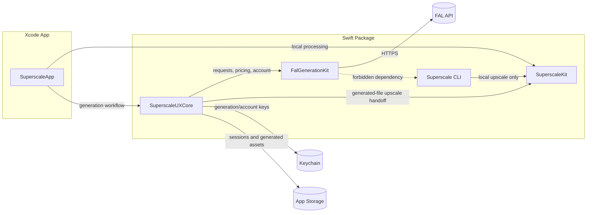
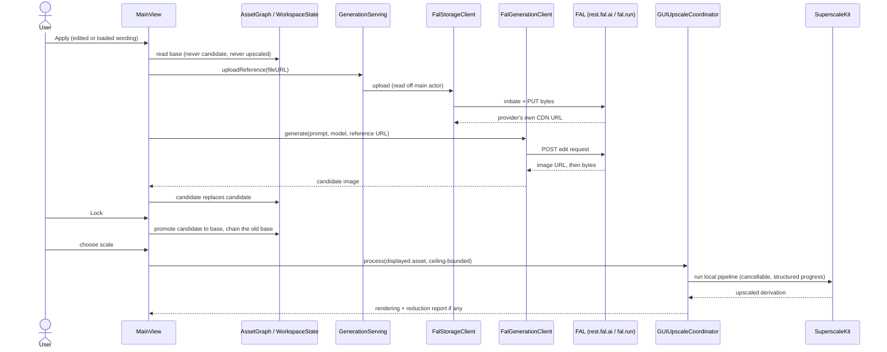

<!-- Version: 1.4 | Last updated: 2026-08-25 -->

# Superscale v2 Architecture

Superscale UX v2 extends the existing SwiftUI app with a GUI-only generation
workspace. The CLI remains focused on local upscaling and must not import the
generation layer.

## Current Shape

The repository currently has these relevant boundaries:

- `SuperscaleKit`: local upscaling pipeline, model registry, model downloads,
  Core ML execution, image processing, and face enhancement support.
- `Superscale`: CLI executable for local upscaling.
- `SuperscaleApp`: SwiftUI app built around `MainView` and
  `UpscaleViewModel`.

V2 preserves those boundaries and adds generation support beside the app, not
inside the CLI.

## Target Module Boundary

The preferred target layout is:

- `SuperscaleKit`: unchanged public role for local processing.
- `FalGenerationKit`: FAL HTTP client, model registry, pricing/account clients,
  request builders, response parsers, and test fixtures.
- `SuperscaleUXCore`: the asset graph, GUI-facing orchestration, prompt packs,
  session history, settings abstractions, and handoff into `SuperscaleKit`. The
  asset graph owns every image the application holds and the lineage between
  them, and it is what decides which asset a stage may read; a location chosen
  for display cannot be submitted for processing.
- `SuperscaleApp`: SwiftUI views, view models, menus, and platform integration.
- `Superscale`: existing CLI executable, with no dependency on
  `FalGenerationKit` or `SuperscaleUXCore`.

The default implementation decision is to create Swift package targets for
`FalGenerationKit` and `SuperscaleUXCore`. If the Xcode project makes that
awkward, app-internal groups may be used temporarily, but the dependency rule
still applies: generation code is GUI-only and independently testable.

## Runtime Flow

*As built. Text-to-image generation is excluded from the MVP; the flow below
is the filter (image-to-image edit) path the application actually runs, with
one reference which is always the working image. The pre-delivery
text-to-image flow with live pricing is in git history.*

Applying a filter:

1. The user selects a filter; its wording loads into the editable prompt field
   and nothing is sent. Applying sends the field as it stands.
2. `MainView.submitFilter` reads the **base** asset from the asset graph ---
   never the candidate, never an upscaled rendering (invariant I1) --- and,
   where the base's long edge is under the 1024 floor, the picture is raised
   first and the user told (#96, guide 2.5).
3. `GenerationServing.uploadReference(fileURL:fileName:apiKey:)` hands the
   file's *location* to `FalStorageClient`, which reads it off the main actor,
   initiates against provider storage and PUTs the bytes (#102, #107). The
   returned CDN URL is the provider's own and is never cached (AC92.3).
4. `FalGenerationClient.generate` posts the edit request --- prompt, model,
   aspect ratio, the reference URL --- and downloads the returned image.
5. The result enters the asset graph as the **candidate**, replacing any
   prior candidate (AC89.1); the canvas shows it; the curtain compares it
   against the base it descends from (AC94.3).
6. **Lock** is the only action that moves the base: it promotes the candidate
   at its own resolution and appends the old base to the lock chain (AC89.2).

Local upscaling is a *derivation* of whichever asset the canvas shows: the
graph allocates the output location (`WorkspaceState.recordUpscale`, #103),
`GUIUpscaleCoordinator` bounds the request by the 32-megapixel area ceiling
(`UpscaleCeiling.decide`, #91) and runs `SuperscaleKit`'s pipeline, lent by a
`PipelineCache` actor so the model load is paid once (#84). An upscaled asset
is terminal: the graph refuses it as input to any further stage (AC89.4).

## FAL Client Layer

*As built in `FalGenerationKit`. Wire-level detail --- endpoints, parameters,
accepted values, response and error shapes --- lives in
`FAL_REQUEST_REFERENCE.md`, which is cited from live probes (#107), not from
SDK source.*

`FalStorageClient` (the reference upload, #92/#102/#107):

- initiates against `rest.fal.ai/storage/upload/initiate?storage_type=fal-cdn-v3`
  and PUTs the bytes to the signed address the provider returns;
- takes a file *location* and reads it once, off the main actor;
- holds nothing between calls --- uploaded URLs expire at the provider's
  discretion, so every apply uploads afresh, structurally (a `struct` with
  nowhere to cache);
- sniffs content type from bytes, never from the file extension.

`FalGenerationClient` (#97/#98):

- builds `https://fal.run/{endpoint}` requests through a **table** of model
  handlers keyed by endpoint ID --- adding a model is an entry, not a branch;
- sizing belongs to the endpoint: `aspect_ratio` is sent only where the
  endpoint accepts it, and the edit endpoint's rejection of it is recorded;
- sends `Authorization: Key <generation-key>`, header only;
- parses every failure through the one shared parser (both FastAPI `detail`
  shapes), redacts **before** truncating, and downloads the returned asset.

`FalPricingClient` and `FalAccountClient` are **present, unreferenced, and
paused for the MVP** (guide section 6): grok is a documented flat 2c, so
nothing calls them, no account endpoint is ever contacted (AC89.7), and the
account/admin key is stored for the future without verification. That stance
produced a control-feedback defect, closed by #109: the row's badge read from
whether its text field held anything, so it flipped to "stored" on the first
keystroke and the save press had no change left to make. The badge now reports
the Keychain --- typed is not stored --- and the row states in the scene that
its key is held unchecked. The absence of verification is unchanged. They
return when a
second model makes a flat rate untenable; the cost-confirmation policy that
consumed their output is gone entirely (#95, #103, AC76.3 superseded by
AC103.2).

## Model Registry

*As built by #97.* The registry is data-driven and holds **one selectable
model**, `xai/grok-imagine-image`, with its `/edit` sibling for
image-to-image; the `fal-ai/flux-pro/kontext` handler remains in the table,
unselectable, as the shape-proof that adding a model is an entry rather than
a branch. Each entry describes the endpoint, its accepted aspect ratios (an
unsupported ratio snaps to the nearest and says so), which sizing parameters
each endpoint accepts, and how a reference takes its field's shape.

Views do not construct provider payloads; the handler table does. That the
handler is a table rather than a `switch` is itself tested --- the property
"admits more models" could not be tested of a `switch`, because a test cannot
add a `case` at runtime.

## Prompt Packs

Prompt packs provide the pre-canned AI filters. They are bundled app resources
that describe themselves in a JSON frontmatter block carrying a stable
identifier, a name, a category, and whether the filter needs an input image.
Nothing is derived from the filename. User-defined filters can be added later
now that the bundled resource format is stable.

A filter is prompt text, not a configuration: it carries no model list, because
any model that accepts a reference image can run any filter.

Selecting a filter and applying it are two steps. Selecting loads the filter's
own wording into the editable prompt field and sends nothing, so the whole
catalogue can be read at no charge. Applying sends the field as it stands,
edited or not; an edit lasts for that run and does not change the built-in
filter. Text written with no filter chosen is applied as written, and applying
with nothing to send is refused.

The prompt system supports:

- user-entered prompt text;
- filter wording loaded for editing;
- reference-image requirements.

Prompt packs should not hard-code paid generation assumptions. The selected
model and pricing service should determine the final cost estimate.

## Secrets And Settings

The GUI stores secrets in Keychain:

- FAL generation key;
- FAL account/admin key.

~~Import from `pix` configuration may be offered as a convenience.~~ This was
removed from v2 scope. Users provide credentials directly through the GUI, and
the app has no `pix` configuration parser or command-resolution path.

Non-secret settings live in app preferences (`GenerationPreferences`, exactly
these four):

- output folder (defaults to Downloads, resolved through `FileManager` rather
  than assembled; a stored folder that no longer exists falls back);
- default generation model;
- default upscale model (`"auto"` by default);
- default prompt pack selection.

**No cost-confirmation threshold is stored** and the policy that consumed it
is absent (AC103.2; #95 removed the control and the key, #103 the types). A
stored value nothing reads is a thing a later reader must prove is dead ---
RT-103.5 pins the absence.

## Storage

The app should keep generated and processed assets in app-managed storage before
the user saves final files. The default storage model is plain image files plus
JSON metadata. A database is unnecessary for the first v2 implementation.

Session records include:

- source prompt;
- selected model and endpoint;
- generated file URL;
- upscaled file URL, if any;
- reference images;
- cost estimate, if available;
- timestamp;
- non-secret request diagnostics.

This history enables comparison, retry, and auditability without logging API
keys or full account data.

## UX Structure

**There is one workspace, and the image is the window.**

An earlier iteration proposed mode-level navigation with Upscale, Generate,
History and Settings as peer surfaces. That framing was built and then removed
in #87: filtering an image and upscaling it are stages of one piece of work, and
making them peers meant the user carried the image between them by hand. It was
also the root of the cross-mode state defects recorded in the implementation
guide.

What replaced it:

- **The canvas** holds the working image, filling most of the window, with drag
  and drop, the comparison view and the magnifier as before.
- **The filter panel** sits beside it: the catalogue within its categories, the
  editable prompt area, and Apply with the flat rate beside it.
- **Settings** is a `Settings` scene on `Cmd+,`, in its own window.
- **Prior sessions** reach the user through `File > Open Recent`, bounded to the
  ten most recent. There is no History surface.

A filter reads the working image at its own resolution, never the upscaled
rendering of it, which is invariant I1. Upscale results remain saveable through
the existing save flow.

## Error Handling

*As built by #98 and #104's family of findings.*

**One parser, one surface, one owner.** Every provider failure --- from the
generation client, the storage client, or any future caller --- is read by the
same parser, which understands both FastAPI `detail` shapes (string and list),
carries the request identifier, and **redacts before truncating**, because the
other order leaves a fragment of a secret straddling the limit. Every failure
reaches the user through one presentation surface;
`UpscaleViewModel.errorMessage` is `private(set)` with `report` and
`dismissError` the only ways in, so a later path finds nowhere else to write
and fails to compile. The one deliberate exception is the face-model download
sheet, which is modal and shows its own failure inside its own flow (AC98.5).

**That compile-error guarantee is narrower than it reads, and #113 found the
gap.** It stops a path writing the message somewhere else. It does nothing about
a path that never reports at all. A failed generation request set the
coordinator's phase to `.failed` and stopped there; nothing in the view observed
that, and the status bar's caption rendered the diagnostic only because it reads
the phase on every redraw. So a provider error arrived in caption type at the
foot of the window, in the place reserved for ambient state, without any code
having written `errorMessage` at all. The view now observes the failure message
and routes it to `report`. When reading the guarantee above, read it as *no path
writes this field except through `report`*, not as *no failure escapes*.

Failure semantics worth knowing cold:

- an upload that fails is reported against the **filter stage**, and the base
  and any candidate survive it (AC92.5);
- nothing is sent before a file read succeeds, so the provider is never left
  holding a URL with nothing behind it (RT-102.2);
- an unreadable file's error carries the *reason* as well as the name --- a
  deleted picture and a permissions problem need different remedies;
- cancellation is not a failure: a superseded run is discarded silently, and
  `publish`/`abandon` guard on `activeRun` so a replaced run cannot land after
  its replacement (#104, #105);
- a control that accepts a click must cause something or say it did not
  (guide 3.9; the rule #104 and #109 were both found violating).

```mermaid
stateDiagram-v2
    [*] --> Empty
    Empty --> Working: import (raised to the floor if undersized, and told)
    Working --> Filtering: Apply (upload, then edit request)
    Filtering --> Candidate: result on canvas, curtain vs base
    Filtering --> Working: failure at one surface; base and candidate survive
    Candidate --> Working: Lock promotes at own resolution, chains old base
    Working --> Upscaling: scale chosen (ceiling-bounded, reduction reported)
    Candidate --> Upscaling: scale chosen (derivation of displayed asset)
    Upscaling --> Working: rendering shown; upscaled asset is terminal
    Upscaling --> Working: cancelled silently, or failure at the one surface
```

## Testing Strategy

*As built. The full testing doctrine is guide section 7; this is the
architecture-level shape.*

**Four suites, strictly separated:**

- `make test` --- the package regression suite (533 tests at handover), plus
  the layout guard. Hermetic: every FAL exchange runs against an injected
  stub transport, no credential is readable, no network is reachable.
- `make test-gui` --- the XCUITest suite (101 tests). Every test launches the
  app with `UITestCredentialStorage` and stubbed generation service and
  verifier (`SuperscaleApp.swift:59-71`), so the real Keychain is never read
  and no live endpoint reachable. Needs the machine to itself and the display
  awake (guide section 7 --- `caffeinate` plus a keepalive).
- `make test-ssim` --- the quality gate against PyTorch references; required
  whenever the v1 pipeline core changes.
- `make test-one-off` --- the separate `OneOff/` package, unreachable from
  `make test` by *location*, not by filter. Skips `LiveTests`.

**Live one-offs ran once and are not repeated.** OT-107.1 to OT-107.4 proved
the wire protocol against the real provider --- initiate, CDN round trip, grok
generation, error shape --- because the stubs verify we send what we *believe*
the protocol is, and #107 was the day belief and reality differed. The entry
point, if ever needed again, is `scripts/run-live-ot.sh`, which sources
`.env`; there is deliberately no make target.

**The stub-and-live division is a doctrine, not a habit:** stubs must match
the live response shape field for field (checked against the #107 probe), and
any future protocol change re-proves through a live OT before the stubs are
trusted again.

## Changelog

- **1.4 (2026-08-25):** Rewritten to as-built for the handover. The runtime flow is the filter
  path the application runs (upload to provider storage, edit request, candidate, lock), not the
  removed text-to-image design; the FAL layer section records the storage client, the handler
  table, and the paused pricing/account clients with the tickets; preferences are the four that
  exist, with the cost threshold's absence pinned; error handling records the one-parser,
  one-surface, one-owner shape and the cancellation semantics; the testing strategy records the
  four separated suites and the once-only live OTs. Sequence and state diagrams redrawn to match.
- **1.3 (2026-08-24):** Replaced the mode-level navigation recommendation with
  the single workspace as built in #87: one canvas, a filter panel beside it, a
  `Settings` scene, and prior sessions on `File > Open Recent`. Recorded that a
  filter reads the working image at its own resolution rather than its upscaled
  rendering.
- **1.2 (2026-08-23):** Recorded the filter catalogue as described by its own
  frontmatter rather than by filenames, and selection as a two-step flow in
  which choosing loads a filter's wording for editing and sends nothing,
  following #85. Removed the model-compatibility and prompt-template language,
  which described a configuration a filter never carried.
- **1.1 (2026-08-23):** Recorded the asset graph as part of the
  `SuperscaleUXCore` module boundary, following its introduction in #81.
- **1.0 (2026-08-05):** Promoted the v2 architecture to the canonical project
  documentation set.
