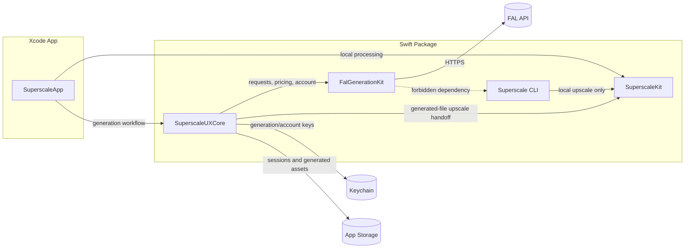
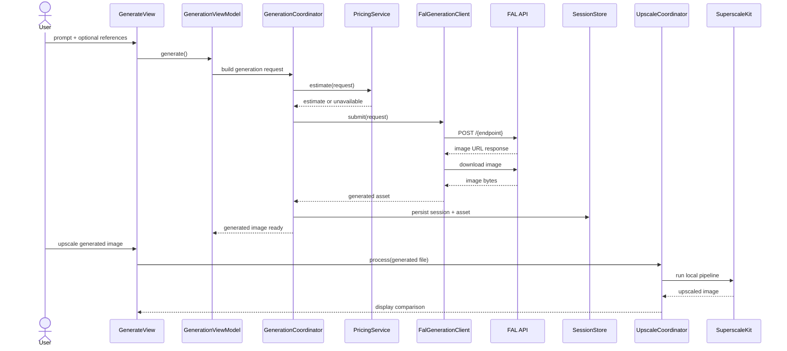
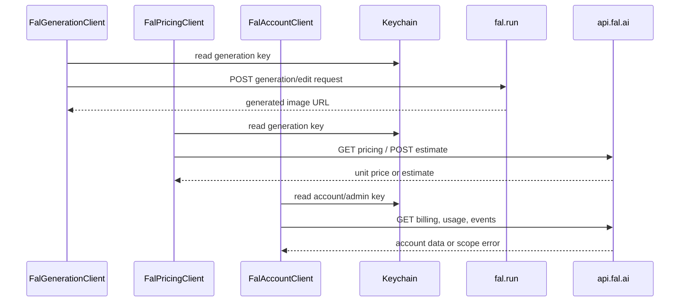
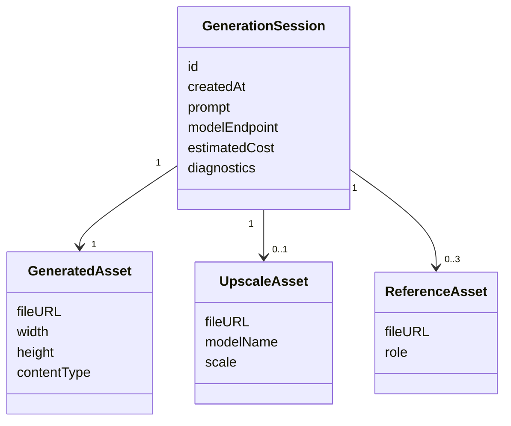
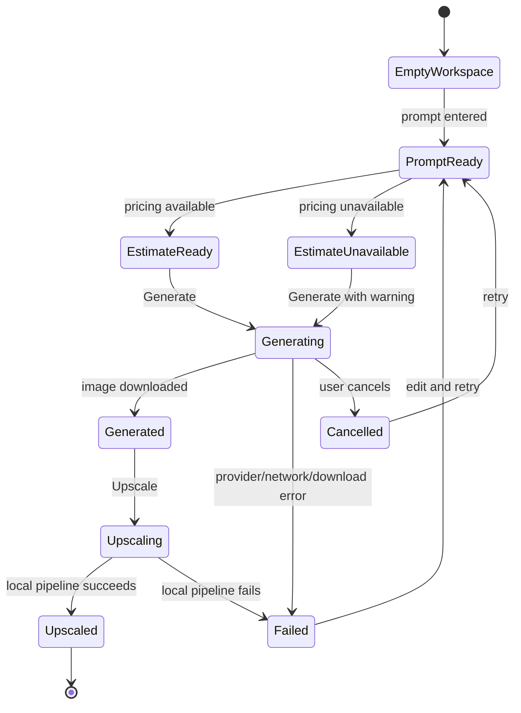

<!-- Version: 1.2 | Last updated: 2026-08-23 -->

# Superscale v2 Architecture

Superscale UX v2 extends the existing SwiftUI app with a GUI-only generation
workspace. The CLI remains focused on local upscaling and must not import the
generation layer.

## Current Shape

The repository currently has these relevant boundaries:

- `SuperscaleKit`: local upscaling pipeline, model registry, model downloads,
  Core ML execution, image processing, and face enhancement support.
- `Superscale`: CLI executable for local upscaling.
- `SuperscaleApp`: SwiftUI app built around `MainView` and
  `UpscaleViewModel`.

V2 preserves those boundaries and adds generation support beside the app, not
inside the CLI.

## Target Module Boundary

The preferred target layout is:

- `SuperscaleKit`: unchanged public role for local processing.
- `FalGenerationKit`: FAL HTTP client, model registry, pricing/account clients,
  request builders, response parsers, and test fixtures.
- `SuperscaleUXCore`: the asset graph, GUI-facing orchestration, prompt packs,
  session history, settings abstractions, and handoff into `SuperscaleKit`. The
  asset graph owns every image the application holds and the lineage between
  them, and it is what decides which asset a stage may read; a location chosen
  for display cannot be submitted for processing.
- `SuperscaleApp`: SwiftUI views, view models, menus, and platform integration.
- `Superscale`: existing CLI executable, with no dependency on
  `FalGenerationKit` or `SuperscaleUXCore`.

The default implementation decision is to create Swift package targets for
`FalGenerationKit` and `SuperscaleUXCore`. If the Xcode project makes that
awkward, app-internal groups may be used temporarily, but the dependency rule
still applies: generation code is GUI-only and independently testable.

## Runtime Flow

Text-to-image generation:

1. User enters a prompt, or selects a filter and edits the wording it loads.
2. `GenerationViewModel` resolves the selected model and prompt options.
3. `GenerationCoordinator` asks `PricingService` for a cached or live estimate.
4. User starts generation.
5. `FalGenerationClient` posts to the resolved FAL endpoint.
6. The first generated image is downloaded into app-managed storage.
7. The generated image appears in the workspace and can be saved or upscaled.

Image-to-image generation:

1. User adds up to three reference images.
2. `ReferenceImageEncoder` prepares image data for the selected handler.
3. The model handler builds the correct edit payload.
4. The normal generation, download, history, and upscale flow continues.

Generation-to-upscale handoff:

1. Generated output is stored as an image file in app-managed storage.
2. The GUI passes that file into a public app processing coordinator.
3. `SuperscaleKit` runs the existing local pipeline.
4. The app displays generated and upscaled outputs with comparison controls.

The current `UpscaleViewModel` owns much of the app processing flow. V2 should
extract a small GUI-facing processing coordinator so generated files can enter
the same path as dropped files without duplicating pipeline code.

## FAL Client Layer

The FAL layer should be a small Swift service modelled on the working behaviour
in `pix`.

Generation client responsibilities:

- build `https://fal.run/{endpoint}` requests;
- send `Authorization: Key <generation-key>`;
- support text-to-image and image-to-image/edit payloads;
- parse image URLs from FAL responses;
- download generated assets;
- redact secrets in diagnostics.

Pricing client responsibilities:

- fetch live unit pricing for a model endpoint;
- request historical price estimates for specific payloads when supported;
- cache responses for the session;
- surface price unavailable without blocking generation.

Account client responsibilities:

- use a separate account/admin key;
- show balance, recent usage, and billing events when authorized;
- treat account-key failure as non-fatal for generation;
- clearly identify scope errors without leaking key material.

## Model Registry

Model metadata should be data-driven. The initial registry should include the
FAL image models needed for `pix` parity, with `xai/grok-imagine-image` as the
default candidate unless product testing chooses another default.

Each model entry should describe:

- user-facing name;
- endpoint ID;
- supported modes, such as text-to-image and image-to-image;
- accepted aspect ratios or image sizes;
- output formats;
- required and optional payload fields;
- edit sibling endpoint, when applicable;
- pricing support status;
- warnings for unsupported options.

The handler strategy used in `storyboard-gen` is the right pattern for model
families. Views should not know how to construct provider-specific payloads.

## Prompt Packs

Prompt packs provide the pre-canned AI filters. They are bundled app resources
that describe themselves in a JSON frontmatter block carrying a stable
identifier, a name, a category, and whether the filter needs an input image.
Nothing is derived from the filename. User-defined filters can be added later
now that the bundled resource format is stable.

A filter is prompt text, not a configuration: it carries no model list, because
any model that accepts a reference image can run any filter.

Selecting a filter and applying it are two steps. Selecting loads the filter's
own wording into the editable prompt field and sends nothing, so the whole
catalogue can be read at no charge. Applying sends the field as it stands,
edited or not; an edit lasts for that run and does not change the built-in
filter. Text written with no filter chosen is applied as written, and applying
with nothing to send is refused.

The prompt system supports:

- user-entered prompt text;
- filter wording loaded for editing;
- reference-image requirements.

Prompt packs should not hard-code paid generation assumptions. The selected
model and pricing service should determine the final cost estimate.

## Secrets And Settings

The GUI stores secrets in Keychain:

- FAL generation key;
- FAL account/admin key.

~~Import from `pix` configuration may be offered as a convenience.~~ This was
removed from v2 scope. Users provide credentials directly through the GUI, and
the app has no `pix` configuration parser or command-resolution path.

Non-secret settings live in app preferences:

- default generation model;
- default upscale model;
- output directory;
- prompt pack selection;
- cost confirmation threshold;
- session history retention.

## Storage

The app should keep generated and processed assets in app-managed storage before
the user saves final files. The default storage model is plain image files plus
JSON metadata. A database is unnecessary for the first v2 implementation.

Session records include:

- source prompt;
- selected model and endpoint;
- generated file URL;
- upscaled file URL, if any;
- reference images;
- cost estimate, if available;
- timestamp;
- non-secret request diagnostics.

This history enables comparison, retry, and auditability without logging API
keys or full account data.

## UX Structure

The main window should gain mode-level navigation rather than overloading the
existing upscaling toolbar.

Recommended top-level modes:

- Upscale: the current local workflow.
- Generate: prompt, prompt pack, model, references, cost, and output.
- History: prior generated and processed assets.
- Settings: API keys, defaults, prompt packs, and account state.

Generated images should be able to move into Upscale with one action. Upscale
results should remain saveable through the existing save flow.

## Error Handling

Errors should be classified by source:

- missing generation key;
- missing or unauthorized account key;
- model endpoint unavailable;
- unsupported payload field;
- network failure;
- paid generation failure;
- download failure;
- local upscaling failure.

The app should show actionable user-facing errors and keep more detailed
diagnostics available for issue reports. Secrets must be redacted.

## Testing Strategy

Automated tests should not call paid FAL endpoints.

Recommended coverage:

- FAL request construction with `URLProtocol` or local HTTP fixtures;
- parsing successful and failed FAL responses;
- pricing and account response parsing;
- model registry resolution;
- handler payload construction;
- prompt pack loading and compatibility warnings;
- Keychain abstraction using test storage;
- generation coordinator cancellation and retry paths;
- GUI smoke tests for Generate, Upscale, Settings, and History paths.

Manual release checks should include one real FAL text-to-image generation, one
image-to-image generation, one pricing/account display check, and one generated
image upscaled locally.

## Changelog

- **1.2 (2026-08-23):** Recorded the filter catalogue as described by its own
  frontmatter rather than by filenames, and selection as a two-step flow in
  which choosing loads a filter's wording for editing and sends nothing,
  following #85. Removed the model-compatibility and prompt-template language,
  which described a configuration a filter never carried.
- **1.1 (2026-08-23):** Recorded the asset graph as part of the
  `SuperscaleUXCore` module boundary, following its introduction in #81.
- **1.0 (2026-08-05):** Promoted the v2 architecture to the canonical project
  documentation set.
