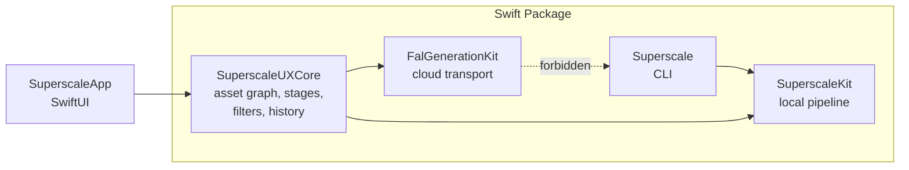
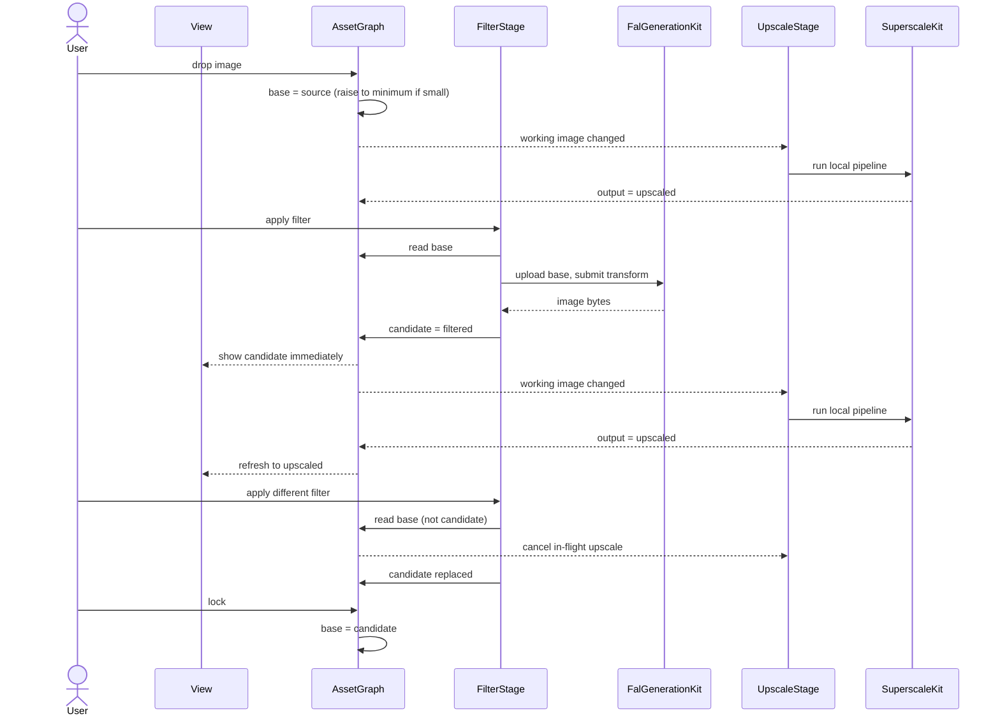

<!-- Version: 3.39 | Last updated: 2026-08-31 -->

# Superscale v2: Solution Design and Implementation Guide

Superscale is a working macOS app that upscales images locally on the Neural
Engine. v2 puts a library of 108 curated AI filters in front of that upscaler.

This is the single design document for the uplift. Wire-level FAL detail is in
the [FAL request reference](FAL_REQUEST_REFERENCE.md); the original upscaler
design is in [v1](v1/).

---

## 1. What We Are Building

**Curated artistic filters, taken to full resolution by native on-device
upscaling.**

Drop a photograph, choose "Film Noir", get a 4096-pixel noir print.

Superscale v2 is **a creative tool built on an image-generation API client**.
The client is not the product; the value added on top of it is.

That value is two things. **The curated filters** carry the artistic intent ---
108 of them, each a considered piece of direction rather than a blank prompt box.
**The native upscale** turns a roughly 1024-pixel API response into a deliverable
at full resolution, locally, in seconds. A cloud filter alone gives you
something too small to use. An upscaler alone gives you a bigger version of what
you already had. Together a photograph becomes a print.

Creative intent runs through the whole app, not just the cloud half: choosing
the filter, adjusting its wording, deciding what to lock, selecting the upscale
model and scale, and judging the result are all creative decisions the app
exists to serve.

The 108 filters in `Sources/SuperscaleUXCore/Resources/PromptPacks/` are
**built-in**, owned by this repository. Their text is **editable at runtime,
before the API call is made**; in the v2 MVP those edits apply to that run only
and are **not saved**.

### What the MVP is for

**To put a coherent, working UX in front of human eyes so it can be refined.**
Not to be feature-complete.

That purpose decides the scope. One model (`xai/grok-imagine-image/edit`), no
generation from a bare prompt, no user-saved filters, no interface rebuild.
Each is deferred not because it is hard but because none of them is needed to
judge whether the core loop --- bring in an image, try filters, lock what works,
upscale, save --- feels right. Anything that does not serve that judgement is
work done before it can be evaluated.

### Direction of travel

The MVP is **filter-first**: every journey starts from an image the user brings
in. The next version adds **generation from a named prompt with no source
image**, moving the app closer to what the `pix` CLI does while keeping the
filters and the native upscale as the reason to use it.

The architecture below accommodates that deliberately rather than deferring it
blindly: the filter format already declares `requiresInput`, and the
asset model already treats a `source` as something that may be created rather
than imported. Adding free-form generation should be a new way to produce a
source, not a redesign.

What v2 is still not: an image editor, or an asset manager.

---

## 2. Functionality

### 2.1 The core journey

1. The user brings in an image --- drag and drop, open, or paste. It becomes the
   **base**.
2. **It upscales immediately**, using the selected upscale model and scale: 2x,
   4x, 8x or a custom resolution. This is v1 behaviour and it is the default.
   Deselecting the scale turns it off (2.5).
3. The user clicks a filter. Its text loads into an editable area --- **no API
   call, no cost**. They can read it, adjust it, or click through others freely.
4. **Apply** sends **the base** --- the image as it stands, never an upscaled
   version of it --- to the API. The **candidate** comes back and is shown **the
   moment the API returns**, before any upscaling. The local upscale then starts
   on it, and the view refreshes to the upscaled version when it completes.
   Applying again, with any filter, sends the base again and replaces the
   candidate. Filters do not stack by accident.
5. When the user likes a result they can **lock** it, making it the new base so
   further filters build on it.
6. **Save** writes the upscaled image where the user chooses.

**Upscaling is reactive, not a step the user takes.** v1 already works this way:
changing the scale or model re-runs the upscale. v2 extends it --- the upscale
re-runs whenever the working image changes or the scale or model changes, and
does nothing at all when the scale is deselected. A user who only wants v1 drops
an image and it upscales, exactly as before. A filter-first user deselects the
scale, explores filters, and selects a scale when ready.

### 2.2 Bringing in an image

Accepts PNG, JPEG, TIFF and HEIC via drag and drop, the open panel, or paste.
One image at a time; this is not a batch tool. The image's true pixel dimensions
are read and shown, and it becomes the base with role `source`.

**Putting a picture away is part of bringing one in.** A picture can be cleared
from the canvas at any time it is not being worked on, which returns the window
to the drop target and so to the chooser the drop target carries. That is the
route back, and it is on the canvas rather than in a menu for a reason worth
recording: the same request was answered three times with a File menu command
that tested green each time and was reported missing each time. A route the user
does not find is not a route.

Clearing keeps the division between what belongs to the picture and what belongs
to the user. The scale, the dimensions, the derivation and the last run's
messages go with the picture. The chosen model, face enhancement, the button
labels and **whether the comparison curtain is switched on** are the user's and
survive. The curtain in particular: 2.3 holds that the application never writes
that setting, and a clear is not an exception to it.

**Four routes reach the empty canvas**, and all of them ask the same question
before discarding anything. The Clear Image control on the canvas, `Cmd+N`, and
`Cmd+O` each warn when a locked iteration has not been saved this session, name
how many are at stake, and can be cancelled without effect. Drag and drop does
not warn: it is a deliberate act on a chosen file, and interposing a dialogue
would make the primary import route hostile.

Where nothing is unsaved, or nothing has been locked, the clear is immediate. A
warning that fires every time is one people learn to dismiss without reading.

`Cmd+N` clears rather than opening a second window. A second window would show a
second view of the *same* lock chain, graph and filter cache, because those are
owned once; giving each window its own is a change to who owns the application's
state rather than a feature, and it is not in this version.

**The clipboard is the third import route, and the one 2.2 has promised since v2
was specified.** `Cmd+C` copies the picture the canvas is currently showing ---
the base when the base is being shown, the derivation otherwise. `Cmd+V` pastes,
**and only onto a blank canvas**: with a picture loaded the command is disabled
rather than warned about, because a mistyped `Cmd+V` is almost certainly an
accident and the cheapest correct answer to an accident is that nothing happens.
A pasted picture enters as an import does and starts a new chain.

**Keyboard access to the scale and the face toggle.** `Cmd+2`, `Cmd+4` and
`Cmd+8` toggle their scale presets, behaving exactly as the buttons do --- the
scale controls are a toggle group, so the same shortcut twice clears the
selection rather than reasserting it. `Cmd+Shift+F` toggles face enhancement,
and is unavailable on the same two conditions as its control on the canvas: no
scale selected, or the face model absent. Not `Cmd+F`, which is Find.

Every one of these commands is named in a menu. A shortcut with no menu entry is
undiscoverable, and two features have already been reported missing when they
existed but could not be found.

**Generating from a prompt alone is in the MVP as of #148**, brought forward at
the author's request. On an empty canvas, typing into the prompt area and
pressing Apply sends the prompt with no reference image.

The corpus remains built for transformation --- 82 of the 108 carry preserve
clauses and 72 explicitly transform "the input image" --- so a filter chosen
with no picture behind it may produce something odd. That is a property of the
prompts rather than of the route, and the route is there for the user's own
words.

This section previously said the MVP had no such entry and that it was "the
next version, not a permanent exclusion". **The prediction it made about the
shape was right and is what was built**: it becomes an additional way to create
a `source` asset, entering the same pipeline at the same point as an imported
image, with filtering and upscaling unchanged downstream.

Mechanically it is the same model without the `/edit` suffix. `FalRequestBuilder`
already chose between the two endpoints on whether any reference was attached,
so sending none selects the text endpoint and restores the sizing parameter that
Grok's edit endpoint refuses. **No reference also means no upload**, so a
from-scratch generation skips the two round trips #137 measured and is the
fastest provider path in the application.

### 2.3 Choosing and applying a filter

Applying a filter costs money, so selecting one must not. The interaction is
**two steps, deliberately**.

**Step one --- select (free).** The filter list is the primary surface: 108 filters
grouped by category (zeitgeist, illustration, sketch, material, print, narrative,
media, design, lighting, institutional, photo), searchable by name. **Narrative
and institutional arrived with #138**, and photo had been in the corpus and
missing from this list. Clicking one loads its text into an
editable text area. **No API call is made.** The user can read the filter, see
exactly what will be sent, and click through as many as they like at no cost.

**Step two --- edit and execute (paid).** The text area is editable ad hoc: the
user may adjust the wording, or send it untouched. A distinct **Apply** button
executes the API call and produces the candidate. The cost sits beside that
button, and running session spend is visible.

Cost is a **known flat rate** for the MVP --- grok is 2c per image --- held as a
documented constant. There is no pricing API call. A live pricing client returns
when a second model makes a flat rate untenable.

There is no auto-apply on selection. It would turn an exploratory session into
an expensive one. Auto-apply may be offered later as an explicit opt-in, but it
is not the default and is not in the MVP.

**Edits are not saved in the v2 MVP.** They apply to that execution only, do not
modify the built-in filter, and do not persist across selections or sessions.
Saving user-authored filters is deferred.

**A result already paid for in this session is shown again rather than
re-requested.** Where the base, the model and the prompt as sent all match a
filtered asset the graph already holds, that asset becomes the candidate and no
provider request is made. The user is told, on the same unobtrusive channel as
the minimum-resolution raise: a paid action completing instantly is a good
surprise only if the application says why.

This is **a read of the graph, not a cache beside it.** Every filtered asset
already records its parent and its provenance, so the question is answerable
from what is held; a parallel store keyed on a hash would be a second place the
truth about a result lives, and the two would drift. It is session-scoped for
the same reason: a held result is only useful while the picture it descends from
is still the one being worked on.

The match is on the prompt **as sent**, so an edit is a different request. That
is the honest comparison, because it is what the provider would be given.

**The MVP ships one model: `xai/grok-imagine-image`.** There is no model picker
to reason about. Every filter runs against it, using its edit endpoint
(`xai/grok-imagine-image/edit`) because every MVP filter takes an input image.

Other rules:

- Filters declaring `requiresInput` are not applicable without a base.
- Any model offered for filtering must accept a reference image. That is a
  property of the model, not the filter --- a filter is plain prompt text and
  works with any model that takes an image. It becomes a real constraint only
  when a second model is added.
- Applying is cancellable while in flight.

**Comparison** is available throughout, as a curtain drawn across the image. It
compares **what is on the canvas against the base it descends from** --- so after
applying a filter it shows the user's own picture against what the filter made of
it, whether or not that has since been upscaled.

**Whether it is drawn is the user's setting and nothing else's.** The Compare
control is a preference, on by default, and the application never writes it: the
curtain appears when the setting is on and there are two assets to compare, and
at no other time. Off means never, on means always.

This was previously incidental. The curtain was switched on wherever a run
published or a held rendering was served, and off wherever a result was
released --- so it followed *work completing* rather than intent, and appeared on
the second operation of a session but not the first. Being told the comparison
is available throughout is no use if the user cannot predict when it will be
there, or turn it off and have it stay off.

The two-asset guard does the rest of the work: with nothing derived there is
nothing to compare, so the setting can be left alone across an import or a
released result without a curtain being drawn over nothing.

The pair is never an image and its own rendering. Pairing them was the earlier
rule, and it produced a comparison whose two sides differed in resolution and in
nothing else: after a filter, the filtered picture against the upscale of that
same filtered picture. Corrected by #94, which supersedes AC90.6's comparison
clause.
The magnifier loupe that once shared this role is removed by slice 9c --- it is a
custom cursor and reads as brittle in use, and the curtain is the instrument this
comparison wants. The divider follows the pointer within the picture's own
displayed frame, which is not the same rectangle as the window.

**Which gesture drives which thing, while the curtain is up.** Two consumers want
the same gestures over the same rectangle, so the split is stated here rather
than left to whichever modifier was written last:

- **Scroll moves the divider.** Whichever axis the scroll is dominantly along, so
  a trackpad's sideways swipe and a wheel mouse, which reports only its vertical
  axis, both work. The sign is taken as the system reports it, so a user whose
  natural-scrolling preference inverts their deltas gets the direction that
  preference implies.
- **Drag moves the picture**, and while the curtain is up it is the only thing
  that does.
- **A single scroll moves one of them, never both**, including with the pointer
  over the divider's own handle.
- **The divider's hit area is larger than the circle drawn for it**, at the
  44-point target the platform asks for. The drawn handle stays 28 points: the
  reachable area and the painted one are different things and only the first is
  about whether a user can take hold of it.

This reverses an earlier binding, and deliberately. Scroll panned the picture,
and it only ever did so inside the curtain --- `ComparisonView` is constructed in
one place --- so nothing outside the comparison changes. The reason to reverse it
is that at zoom the divider most needs moving exactly where the drag is most
wanted for the picture, and a 28-point target over a photograph that also accepts
a drag means a near-miss moves the photograph. The trade is that panning inside
the curtain is by drag alone, which is workable because dragging the picture was
always available.

What does **not** change is that a scroll is only ours when the pointer is over
the picture. That rule was written for a global event monitor that moved the
photograph when the user scrolled the filter strip, and it is about *where the
pointer is* rather than about *what the scroll drives*.

**The two sides share a width and may differ in height.** Each keeps its own
proportions, so nothing is stretched to match the other's shape, and the single
vertical divider therefore falls at the same fraction of width on both. Fitting
each side into the canvas independently gave a 1:1 return a different width from
a 3:4 original, so one line meant two different things --- which is what grok
produces whenever the picture it is given has a short edge under 1024. The
shared width is bounded by the canvas: the canvas's own width where both sides
fit, and otherwise whatever width makes the taller of the two exactly fill the
canvas's height, because using the full width unconditionally clips the more
portrait of the two off the bottom. Corrected by #96, which supersedes AC90.10.

**A return whose shape differs from what was sent is recorded as such**, on the
asset rather than recomputed by the view. What was sent is not always the parent
--- the area ceiling reduces a picture before it goes and the minimum-resolution
floor raises one --- so a view deriving the answer from the parent's size would
be describing the graph while appearing to describe the provider.

**And the user is told.** Recording it is not the criterion: a user who sees a
square result from a portrait photograph has to be able to tell whether this
application or the provider did it, and a fact held only on the asset answers
that for nobody. The notice goes to the status bar, on the same channel as the
minimum-resolution raise and the area reduction --- unobtrusive, because the
application has handled the situation correctly and is reporting rather than
asking. Where either size is unrecorded, nothing is said: telling a user
something on a guess is worse than staying quiet.

### 2.4 Lock

**Lock** is the only action that moves the base. It promotes the current
candidate, so subsequent filters build on top of it. That is how deliberate
stacking is expressed --- noir *then* woodblock, rather than woodblock instead of
noir.

Because a filter always reads the base, switching filters compares them against
the user's photograph rather than against each other's output. Lock is
unmistakable in the interface, because it is the one action that changes what
subsequent filters consume.

**Lock always captures the image at model resolution, never its upscale.** The
upscale is a deterministic local derivation: given the same image, model and
scale it can be reproduced at any time in seconds. There is nothing to preserve
by locking it, and locking it would put oversized pixels in front of the next
filter. So what is locked is the filter's own output, or --- in the
minimum-resolution case --- the source raised to the assumed minimum.

This is why the base is always valid filter input, and it is the whole reason
the invariants in 3.2 hold without special cases.

#### Locked iterations

Locking does not discard what came before. Each lock extends a chain, and the
user can **scroll back through previously locked iterations**, view any of them,
**select** any of them, and **save any of them**.

**Selecting an earlier iteration restores the working context it was made in.**
The selected iteration becomes the candidate, and the asset it was filtered from
becomes the base. Nothing is copied and no history is discarded: the pair is read
back off the lineage the graph already holds.

That single rule settles three things that otherwise need separate answers:

- **What a filter reads.** The base, exactly as everywhere else. Selecting an
  iteration moves the base to that iteration's own parent, so filtering after
  selection transforms the picture the user is looking back at rather than the
  most recent lock. The rule in 2.3 is unchanged; only the base has moved.
- **What the comparison shows.** The candidate against the base it descends
  from, which for a selected iteration is the picture it was made from. The
  filtered/original toggle therefore works on an earlier iteration exactly as it
  does on a fresh one.
- **What an upscale derives from.** The working image, which is the candidate
  when one exists. Selecting an iteration makes it the candidate, so the upscale
  runs on the selected picture.

Selection moves the base **backwards**; lock moves it **forwards**. A base that
moved only forwards made an earlier iteration something a user could look at but
not work from, which is the state the author reported as filters landing on the
wrong picture.

**The chain shown is the lineage of the furthest-forward lock, not of the base.**
This is the part a naive reading of the rule above gets wrong, and getting it
wrong is not a cosmetic error: the chain was derived by walking back from the
base, so a base that moves backwards takes every later iteration off the strip
with it. That is precisely the unreachability #111 was raised to fix, arriving
again by a new route --- and it passes every test #111 left behind, because none
of them moves the base.

**So the chain is held, not derived.** It is the record of what has been made, in
the order it was made: an import starts it, a promoted raise joins it, and each
lock appends to it. The base and the candidate say where in that record the user
is standing. AC89.3's requirement that every locked iteration stay reachable then
holds in every direction, and returning to the newest iteration is the same
operation as selecting any other.

**Deriving it from a pointer was tried twice and failed twice.** From the base,
where a backwards move lost everything forward of the selection. Then from a
*tip* --- the furthest-forward lock --- where locking after a selection abandoned
whatever the tip had been pointing at, because lock advanced it. Both versions
looked correct in isolation and both destroyed work the user had paid the
provider for. The chain is not a lineage and treating it as one keeps producing
the same class of loss.

The lineage still exists, on each asset's `parentID`. It records what descends
from what, and I2, I3 and the session filter cache all depend on it. It is simply
not what the strip is read from.

Saving an earlier iteration upscales it on demand at the current settings,
because the upscale is deterministic and need not have been kept. This is what
makes discarding upscales at lock time safe rather than lossy.

The chain is the lineage the asset graph already records, so this needs no
separate history structure: walking back through locked iterations is walking
the parent chain of the current base.

### 2.5 Upscaling

Upscaling runs the existing local pipeline: content-based model auto-selection
or an explicit choice from the seven Real-ESRGAN models, a scale factor or
target dimensions, and optional face enhancement.

**It is reactive.** The user does not invoke it; it runs whenever there is a
scale selected and something to run on, which is how v1 already behaves.

**It never blocks the view of a filter result.** The API round trip is already
slow, and the upscale adds processing on top of it --- plus roughly three seconds
of model load, on the first run for a given model and setting. A
`PipelineCache` actor holds the loaded pipeline afterwards, so that load is not
paid again while it is held. Stacking even the processing means a wait before
the user sees anything, on the one decision they most want fast feedback about:
did the filter work.

So the candidate is **displayed as soon as the API returns**, at model
resolution. The upscale starts after that and the view **refreshes
asynchronously** to the upscaled version when it completes, with an unobtrusive
indication that it is running. The user judges the creative result immediately
and gets the quality shortly after.

This falls out of upscaling producing an output without advancing state: the
candidate stays the candidate, and the upscaled image is a rendering of it that
arrives late. Applying another filter mid-upscale cancels it, because the
working image has changed.

- It reads the working image --- the candidate if one exists, otherwise the base.
- It re-runs when the working image changes (a filter applied, a candidate
  locked) or when the scale or model changes.
- It **produces an output without advancing state**, so the user can look at a
  upscaled result and carry on trying filters.
- Each run derives from the working image and writes a **new** file. It never
  re-processes its own output and never overwrites a previous result.
- Progress is reported per stage, and it is **cancellable** --- it is the long
  local operation.
- Output is bounded at **32 megapixels of area**, not by edge length. Beyond it
  the scale is reduced to the largest that fits, a custom target is reduced
  proportionally, and the reduction is reported; a picture that fits at no scale
  is left as it is, with the reason given. The reason is memory, quantified in
  section 3.8.

  **The unit matters.** The bound was previously a long edge --- a warning above
  4096 and a refusal above 8192 --- which says nothing about area: 8192 x 8192 is
  67 megapixels and about 2.4 GB, while 8192 x 1000 is 8 megapixels and about
  300 MB. The rule treated those two alike, and a 2000-pixel-wide picture at 4x
  produces 8000 on the long edge, which sat between the two thresholds:
  permitted, and fatal. Corrected by #91.

  **The scale selection is not rewritten by a reduction.** AC82.8 holds that it
  changes only when the user changes it, so the control keeps showing what was
  asked for and the message reconciles it with what ran.

  **The minimum long edge of 2.5 is unaffected.** A floor expressed as an edge
  and a ceiling expressed as an area answer different questions: whether a
  picture is large enough for the provider to work with, and whether its output
  fits in memory.

#### Automatic upscaling, and turning it off

In v1, dropping an image **upscales it immediately** at whatever scale is
selected, and changing the scale or model re-runs it. That reactivity is kept:
an upscale still runs whenever there is a scale selected and something to run
on, and the user never invokes it directly.

**What changed is the launch default: nothing is selected.** The v1 experience
put a scale in effect from the start, so a session's first action was always an
upscale. The argument for the off switch below --- that a filter-first user does
not want that upscale at all --- applies with equal force to the default, and in
use the cost was being paid on the first action of every session before the user
had chosen anything. A user who wants the v1 behaviour selects a scale once and
it is reactive from then on, exactly as before.

The selection is not persisted between sessions. It could be, and deliberately
is not: a scale carried over from yesterday's picture is a decision made about a
different image, and it would reintroduce the surprise this default removes.

It needs an off switch in v2. In a filter-first session the user usually wants
to filter before upscaling, and auto-upscaling on import spends processing --- and
on the first run, roughly three seconds of model load --- on an output they are
about to set aside. The cache removes the repeat cost, not the first one, so the
argument for the switch stands: a filter-first user does not want that upscale at
all, however cheap the second would be.

**Toggling off is done by deselecting the active scale button.** The scale
control (2x, 4x, 8x, custom) becomes a proper toggle group: clicking the
selected button clears it, and with nothing selected there is no upscale. Drop an
image with scale off and it simply becomes the base, ready to filter. Select a
scale later and upscaling runs then.

This needs an **off state in `ScaleMode`**, which today is only `.preset(Int)`
or `.custom`, and buttons that clear rather than re-select when the active one is
pressed.

Correctness does not depend on this. The invariants already guarantee a filter
reads the base, so even an auto-upscaled image is never filtered. The toggle is
about wasted work and user control, not safety.

#### Minimum resolution for filtering

An **edge case**, not a step in the journey. An image can be too small to give a
filter enough to work with.

**The minimum is 1024 pixels on the long edge.**

This is an assumption, not a published figure: FAL does not document a minimum
input size per model, and it varies. It is held in **one named constant**, and
is revisable if real usage says otherwise. Long edge rather than a fixed
width and height, so portrait, landscape and square are all covered without
baking in an aspect ratio.

The supporting evidence is indirect: `pix` maps its aspect presets to sizes
around `1536x1024`, and `storyboard-gen` prices on roughly one megapixel per
image, which `1024x1024` matches. Both indicate the scale these models work at.

A per-model override belongs in the model registry if a provider ever documents
a real figure.

It needs no special machinery. The app performs the sequence the user could have
performed by hand:

1. **Import** the small image.
2. **Upscale** it to the minimum required.
3. **Lock** that result, so it becomes the base.
4. **Turn the upscale toggle off.**

An unobtrusive message says the image was raised to the minimum size for
filtering. From that point the session is completely ordinary: the base is a
normal base, filters read it as usual, and the user can turn the scale back on
whenever they want a final upscale.

Turning the toggle off matters. Without it the app would keep re-upscaling an
image that is already at the size the filter wants, spending time on work that
is immediately discarded.

The user may still change the upscale model and amount freely. **Whenever a
change would drop the image below the minimum, it is raised again and the
message is shown again.** The floor is enforced continuously, not only on
import.

**The check therefore sits at Apply, not at import.** Every submission passes
through one place, and the base can change after import --- a lock, a model
change --- so a check made only on the way in satisfies the criterion and leaves
the defect in place on every subsequent apply. Built by #96.

**A picture too small to reach the floor at any offered scale is raised as far
as it goes, and the user is told the provider may change its shape.** The
control offers 2x, 4x and 8x, so a 50-pixel picture reaches 400 and no further.
Refusing it outright would be worse than sending it: the same reduce-and-tell
posture the area ceiling takes in the other direction.

**A raise is not an upscale, and the asset roles keep them apart.** A
`raisedToMinimum` asset targets the filter model's working resolution and
remains valid filter input; an `upscaled` asset targets the size the user asked
for and is terminal, which the graph enforces by refusing it as a stage input.
Recording a raise as an upscale would make the floor unenforceable, because the
raised picture could then never be sent.

**A raise is still work, so it reports.** It runs the same Neural Engine
operation and takes the same seconds as any other upscale, and AC94.1's rule
covers work of any kind on the working image. It also **records what it produced rather
than what it asked for**: a model whose native scale is lower than the scale
requested delivers less, and a raise recorded at its target would claim a floor
it never reached, so the next apply would send an undersized picture believing it
had been corrected.

**The floor reads pixels, not points.** `NSImage.size` is DPI-adjusted, so a
2048 x 1536 photograph saved at 300 dpi reports about 492 x 369 --- undersized by
this rule's reckoning, and raised 4x it does not need. Every size the asset graph
records comes from `ImageDimensions.pixelSize(of:)`, which reads the file's true
pixel dimensions, and the area ceiling and the scale readout depend on the same
thing. There is exactly one such function, because the defect existed *precisely*
because the view and the view model each had their own and nothing could tell
them apart.

**Asking a picture its size must not decode it.** The obvious implementation of
that function loads the image and reads the result's dimensions, which
decompresses the whole thing --- and, where there is an alpha channel, builds a
second full-size plane --- to keep two integers. At the 32-megapixel ceiling that
is roughly 160 MB allocated and thrown away, and one caller measures on import,
on the main actor, so it is paid on the thread drawing the window.
`CGImageSourceCopyPropertiesAtIndex` answers from the file's header at no such
cost. Two things make it the right answer rather than merely the cheap one:
`kCGImagePropertyPixelWidth` is the stored pixel count and so is immune to the
DPI that caused this rule, and it is uncorrected for EXIF orientation --- as is
the decode the upscaler itself performs, so a rotated photograph measures as the
pipeline will actually treat it. An orientation-correcting source would look more
careful and would disagree with the pixels.

**With the scale off, Save writes the picture as it stands.** The raise turns the
scale off, so binding Save to a completed upscale --- as it was --- leaves a user
who has just filtered a small photograph with a result they paid for and no way
to write it to disk.

**Face enhancement is unchanged from v1.** GFPGAN is not bundled, because of its
non-commercial licence. It is present only if the user deliberately downloaded
it through the licence-acceptance flow, or it is already on the system. When it
is absent the option is simply unavailable, and the pipeline skips the stage.
The toggle's default follows installation state, and the pipeline guards on both
the toggle and installation. v2 changes none of this.

### 2.6 Saving and session history

Save writes to the configured output folder with a descriptive filename derived
from the source and the operation. Any locked iteration can be saved, not only
the current one (2.4).

**There is no History workspace.** What a user wants mid-session is the locked
iterations, and those live in the sidebar. Reaching an older piece of work is
what **`File > Open Recent`** is for --- the native Mac answer, and enough.

A session record still exists on disk for recovery and audit: the source, the
filters applied, the outputs, model metadata and timestamps. Secrets are never
written to it. **Local-only upscales are recorded too**, which today they are
not.

### 2.7 Settings

Settings is a real macOS `Settings` scene on `Cmd+,`, not a workspace.

One FAL credential is required for the MVP: a **generation key**, held in the
Keychain, used for filters and upload.

A separate **account key** for balance and billing exists in the codebase and is
retained, but no MVP feature uses it, because pricing and account visibility are
paused (see 6). When they return, the standing rule applies: the privileged key
never falls back to the everyday one. That is a least-privilege principle across
the project's API integrations, not a FAL-specific choice --- the key used
constantly is the most exposed, so it must not also read billing.

Non-secret settings: default upscale model and output folder. The default
upscale model applies to every upscale, including a plain dropped file.

### 2.8 Degraded states

The app must remain useful when parts are unavailable.

| Condition | Behaviour |
|---|---|
| No generation key | Filters unavailable with a route to Settings. **Local upscaling works fully.** |
| Network failure | Reported against the filter stage. The base and any candidate survive. |
| Provider rejects the request | The provider's reason is surfaced in readable form, secrets redacted. |
| Local pipeline failure | Reported against the upscale stage; the working image survives. |

Cloud actions are visibly distinct from local ones. Local upscaling never leaves
the machine and that stays true; applying a filter uploads the image, and that
is stated where the action happens, not buried in settings.

---

## 3. Architecture

### 3.1 Modules



| Module | Owns |
|---|---|
| `SuperscaleKit` | Tiling, Core ML inference, model registry and cache, alpha, face enhancement, image I/O. No knowledge of the cloud. |
| `FalGenerationKit` | FAL transport, model registry, request handlers, reference upload, pricing, account, error parsing, fixtures. |
| `SuperscaleUXCore` | The asset graph, the two stages, the filter catalogue, session history, settings, storage policy. |
| `SuperscaleApp` | SwiftUI views and platform integration only. |
| `Superscale` | The CLI. Local upscaling only, with no dependency on the two cloud-facing modules. Verified by test. |

~~One correction to the current layout: `V2AppPaths` lives inside
`GenerateView.swift` while the app entry point depends on it. Storage policy
belongs in `SuperscaleUXCore`.~~ **Done, 2026-08-26 (#116).** `StorageRoots` in
`SuperscaleUXCore` is now the single resolution for every directory the
application writes to, and `V2AppPaths` is gone.

It cost a defect on the way. `V2AppPaths` moved from `GenerateView` to the app
entry point when #87 deleted that surface, which was the right direction and
not far enough: `MainView` went on reading it from a `@StateObject` property
initializer while the entry point read it separately. A launch given a test
root redirected the generation coordinator and the session store and left the
workspace's asset graph writing into the user's own application-support
directory. Two resolutions of one thing, with nothing able to tell them apart
- the same shape as the measurement defect AC100.2 records, and the reason the
criterion is *a single configured root* rather than *the right root*.

### 3.2 The asset model

Every image is an asset with a role and a parent. This is what makes the rules
in section 2 structural rather than remembered.

```swift
public enum AssetRole: String, Sendable {
    case source        // brought in by the user
    case raisedToMinimum  // raised only to the assumed minimum long edge
    case filtered      // output of a filter
    case upscaled      // output of an upscale targeting the user's chosen size
}

public struct Asset: Identifiable, Equatable, Sendable {
    public let id: UUID
    public let role: AssetRole
    public let fileURL: URL
    public let pixelSize: CGSize
    public let parentID: UUID?          // lineage
    public let provenance: Provenance?
}

public struct Provenance: Codable, Equatable, Sendable {
    public let filterID: String?
    public let modelID: String?
    public let prompt: String?   // redacted of any supplied secret
    public let sessionID: UUID?  // what session attribution walks the lineage for
}
```

An `AssetGraph` owns the assets, the **base** pointer and the **candidate**
pointer, and is the only place these rules live:

| | Invariant |
|---|---|
| **I1** | An `upscaled` asset is never input to any stage. |
| **I2** | Filters read the base --- never the candidate, never an upscaled asset. |
| **I3** | Every filter application reads the base and replaces the candidate. Results never chain implicitly. |
| **I4** | Lock captures the working image at model resolution, never its upscale. Lock moves the base forward; selecting an earlier locked iteration moves it back to that iteration's own parent, making the iteration the candidate. No other action moves the base. |
| **I5** | Upscaling derives from the working asset and writes a new file. It never consumes or overwrites a previous upscaled output. |
| **I6** | An upscaled asset is attributed to a session only if it descends from that session's lineage. Never by timing. |
| **I7** | The lineage of a locked asset is retained and reachable, so any prior iteration can be viewed, selected and saved. The chain of iterations is held rather than derived from any pointer, so it survives the base moving backwards and survives a lock made from an earlier point. Only a new import empties it. |

Each is pure logic over the graph, testable with no network and no Core ML.

**Upscales are derivations, not state.** An upscale is deterministic: the same
image, model and scale reproduce it in seconds. It is therefore never locked,
never part of the base chain, and never needs to be preserved. That single fact
is what makes I1, I2 and I4 hold without exceptions, and what makes discarding
an upscale safe rather than lossy.

An upscale is discarded when it is superseded: when a later upscale of the same
asset takes its place. Lock discards nothing. One output is current per working
asset, so the number retained stays proportional to the lock chain rather than
to how many times the size was adjusted, and no output is ever overwritten in
place.

**Why two upscale roles.** Both come from one `UpscaleStage`; the target decides
which:

- `raisedToMinimum` targets the assumed minimum long edge (2.5). Nothing is
  wasted by sending it, because that is the size the model wants. It is valid
  filter input and it is what lock captures in the minimum-resolution case.
- `upscaled` targets the size the user asked for. Sending it to a filter would
  discard everything the Neural Engine produced. It is terminal and is never
  locked.

The harm the invariants prevent is *exceeding* model resolution, not upscaling
as such.

**The base chain is the lock history.** Each lock creates an asset whose
`parentID` is the previous base, so walking that chain gives the locked
iterations in order. Scrolling back (2.4) is a read of the graph, not a separate
history store; saving an earlier iteration re-derives its upscale on demand.

**Selecting an earlier iteration is also a read, and moves both pointers.** The
graph sets the candidate to the selected asset and the base to that asset's
`parentID`, which is precisely the pair that existed when the iteration was
locked. Because the lineage is retained under I7, this needs no stored snapshot:
the state is recoverable from the graph at any time. It is why I4 can admit a
backwards move without weakening I2 or I3 --- a filter still reads the base, and
still replaces the candidate; only which asset the base points at has changed.

**Selecting an asset with no parent makes it the base, with no candidate.** The
source has no parent, and neither does a raise to the minimum performed on it, so
the general rule does not reach them. That state is the one a fresh import is
already in, so nothing new is introduced by saying so --- but it has to be said,
because "the base becomes the selected asset's parent" has no answer otherwise.

**The chain is a held list, not a third pointer.** An import starts it, a
promoted raise joins it, and each lock appends to it; nothing ever removes an
entry except a new import. `lockedIterations` reads that list.

Two pointer-derived versions preceded it and each lost work. Derived from the
**base**, a backwards move made every later iteration unreachable. Derived from a
**tip** --- the furthest-forward lock --- locking after a selection abandoned
whatever the tip had been pointing at, because lock advanced it. Both are
AC89.3's failure, and both are #111's defect returning by a different route. The
second was found only by the author, in use, after the first had been fixed.

An unlocked candidate displaced by a selection is not recoverable, and that is
consistent rather than a gap: 2.3 already establishes that applying again
replaces the candidate, so a candidate's impermanence is existing behaviour.
Selection is one more thing that replaces it.

### 3.3 Stages

Local and cloud work take the same shape, so the app has one progress model, one
cancellation model, and one error path:

```swift
protocol Stage {
    associatedtype Options
    func run(input: StageInput, output: StageOutputLocation, options: Options,
             progress: @Sendable (StageProgress) -> Void) async throws -> StageOutput
}
```

**The graph allocates; the stage writes.** A stage does not mint the asset it produces, because
the guarantee that no two upscales collide belongs to the graph: it allocates the asset and the
location, the stage writes there, and the caller records the completion against the reference the
graph already holds. Nor does a stage hand bytes back --- the image is already held in memory once,
and a 4096-pixel output is roughly 50 MB.

A run is observed as a `StageRunState`: `idle`, `running(StageProgress)`, `succeeded`, `cancelled`
or `failed(StageFailure)`. That is one model for both stages, replacing a phase enum on the cloud
side and a boolean on the local one. `StagePhase` carries the counts that belong to it --- faces
enhanced, tiles completed and total --- as numbers rather than as prose a caller has to parse.

The kit reports its own phases as `PipelineProgress`, so the stage maps case to case with no
wording involved. That was not always so: the kit first reported sentences, and the stage
recovered the structure by matching prefixes and splitting on spaces --- which meant rewording
"Enhancing 3 faces..." silently broke the face count. `PipelineProgress.description` is still that
sentence, and it is what the command-line tool prints, so the text a scripted caller reads is
unchanged while nothing depends on parsing it.

`StagePhase.unclassified` remains, and now catches a kit phase the stage does not map --- a
warning, which is a diagnostic rather than a phase, or a case a later kit version adds. It reaches
the caller with its text, so such a report degrades to plain wording rather than vanishing.

**Two stages, not three.** `UpscaleStage` wraps `SuperscaleKit` and serves both
upscale targets; `FilterStage` wraps `FalGenerationKit`. There is no separate
stage for the minimum-resolution case --- raising an image to the minimum is the
same stage with a
different target, which is why the user-visible flow is just upscale and lock.

Today the cloud path has a phase enum and cancellation while the local path has
a boolean and none; this collapses that asymmetry.

The graph publishes each stage's result as it lands, so the view can show a
candidate while its upscale is still running. `UpscaleStage` is therefore
observed independently of `FilterStage` rather than chained behind it, and a
upscale in flight is cancelled when the working image changes --- which is the
concrete reason the kit needs real cancellation (D6).

### 3.4 Flow

Upscaling is triggered by the working image changing, not by the user. Note that
the candidate is published to the view before the upscale starts.



### 3.5 The filter catalogue

The corpus is vendored --- copied once, owned here, with nothing referring to an
external directory. Metadata lives in frontmatter so each filter is
self-contained:

```markdown
---
{
  "id": "image-lighting-film-noir",
  "name": "Film Noir",
  "category": "Lighting",
  "requiresInput": true
}
---

Transform the input image using film noir lighting.
Preserve the subject's identity, pose, expression, clothing, camera angle...
```

The block is JSON rather than YAML, because `CODING.md` requires structured
data to be read by a format-aware parser and `JSONDecoder` is one in the
standard library. YAML would mean either a new dependency for four scalar
fields or a hand-rolled key-value reader, which is a line-oriented parser
wearing a schema.

All four fields are required, and the three strings must be non-empty: a name
that is present but blank decodes perfectly well and ships a blank row in the
list. A file that cannot describe itself fails the corpus rather than being
skipped, because a catalogue quietly short by one is not something anybody
counts.

This replaces deriving metadata by splitting filenames, which has nowhere to
record whether a filter needs an input image. The identifiers are unchanged ---
still the resource name --- because the GUI stores the user's default filter
under that value, and a prettier identifier would make every saved default
resolve to nothing with no error and no message.

The fields are deliberately few. **A filter is prompt text, not a
configuration.** It carries no model list and no compatibility declaration,
because there is no such thing as a filter that suits one image-edit model and
not another --- any model that accepts a reference image can run any filter.
`requiresInput` is the one real constraint, and it distinguishes a transform
("Transform the input image...") from a filter whose body is a pure style
description and could seed generation once that path exists.

**Body convention**, following the strongest existing filters: transform
instruction, preserve clause, style direction, intended feel, avoid clause, and
no markdown headers.

The convention is enforced in the corpus, not in the loader. Everything after
the closing delimiter is carried verbatim: a loader that stripped a leading
heading would satisfy every corpus test while the polluted files stayed as they
were, and would silently truncate the first filter that legitimately opened with
one. `---` is also a horizontal rule, so only the first two delimiters bound the
frontmatter.

### 3.6 Cloud integration

Detail is in the [FAL request reference](FAL_REQUEST_REFERENCE.md). Design
points:

- **Image-to-image is the primary path** for the MVP. The text-to-image path is
  the next version, so handlers and the model registry carry both modes from the
  start rather than being retrofitted.
- **The base is uploaded to FAL storage and passed as a URL.** This replaces the
  base64 data-URI encoding currently in a view. Upload belongs in
  `FalGenerationKit`. Uploaded URLs expire at the provider's discretion and are
  **never cached**.
- **One model in the MVP: `xai/grok-imagine-image`.** Its edit endpoint is the
  plain `/edit` suffix, which is correct for this family, and its edit endpoint
  rejects sizing parameters. **No edit-sibling map is needed to ship**: that map
  exists for kontext, glm, seedream and emu, none of which are in scope. The
  handler is declarative so a second model is a data change, but the family
  matrix in the FAL reference is knowledge held for later, not work to do now.
- **Errors are parsed through the multi-envelope parser** --- gateway shape,
  top-level message, FastAPI `detail` as string or list --- then mapped to the
  taxonomy, redacted, and truncated so an echoed payload cannot flood a
  diagnostic.
- **Pricing and account are out of MVP scope.** Cost is a flat documented
  constant (2c per image). When live pricing returns, the rule is best-effort
  and independent: neither blocks a filter, a failure in one does not suppress
  the other, and results are cached for the session including negatives.
- **Edit endpoints often ignore the requested aspect ratio**, so filter output
  is centre-cropped back to the base's aspect with a small tolerance.

### 3.7 Storage

Assets live in app-managed storage as plain files plus JSON metadata; no
database. A session record links source, filters applied, upscaled outputs,
model and cost metadata, and timestamps. Each upscaled asset gets its own path
derived from its identity, which is what makes I5 hold.

### 3.8 Constraints inherited from the kit

These shape the design and are not discovered late.

- **Memory is the binding limit.** `Tiler.stitch` allocates roughly 36 bytes per
  output pixel, all resident: 4096² is about 600 MB, 8192² about 2.4 GB. Tile
  size does not help --- it affects the inference working set, never the stitch
  buffer. Hence the **area** ceiling in 2.5: 32 megapixels is about 1.2 GB of
  accumulators, which leaves the process, the Core ML model and the window their
  room. It covers stitching alone; face enhancement's working set is additional,
  and the rendering store of slice 9c holds up to four renderings besides. The
  natural design point, a 1024-pixel filter output at 4×, lands at 4096 on the
  long edge and 16 megapixels of area, comfortably inside it.
- **No in-memory entry point** --- the pipeline is URL to URL, which suits the
  asset graph since it persists assets anyway.
- **Model load costs about 3.2s per call**, because `Pipeline` is not `Sendable`
  and a fresh one is built each time. Raising to minimum and then upscaling would pay it
  twice.
- **Progress is unstructured strings**, and the GUI currently parses face counts
  out of message text.
- **No cancellation exists** in the kit.

The last three, plus `LocalizedError` conformance, are `SuperscaleKit` changes.
They are authorized.

### 3.9 Interface

**There is one workspace.** The v1 upscale workspace, extended. Not four modes.

A previous iteration introduced `AppMode` with `upscale`, `generate`, `history`
and `settings` as peer surfaces, and built Generate and History as separate
workspaces. That framing goes. It made the user shuttle images between modes
that are stages of one pipeline, and it is the root of the cross-mode state
defects in section 5.

Everything else is a panel, a sidebar or a sheet around that single canvas:

| Surface | Form |
|---|---|
| Working image | The canvas. Base, candidate, and the upscaled rendering. |
| Locked iterations | **Sidebar.** The lock chain (2.4), scrollable, each entry saveable. |
| Filter catalogue | **Sidebar or sheet** --- open question below. 86 filters, categorized, searchable, with the editable prompt area. |
| Upscale model | **Sheet.** Exactly as v1 already does it. |
| Scale | Toolbar toggle group, as v1, now with an off state. |
| Settings | A real macOS `Settings` scene on `Cmd+,`, not a mode. |
| Prior sessions | **`File > Open Recent`.** No separate History surface. |

Two consequences worth stating:

- **History as a workspace is removed.** What a user actually wants mid-session
  is the locked iterations, which the sidebar gives them. Reaching an older
  piece of work is what Open Recent is for, and it is the native Mac answer.
- **Settings must become a `Settings` scene.** It is currently a mode, so
  removing modes forces it. That is the correct destination anyway.

**Resolved as a sidebar** (#87, 2026-08-24). Browsing 86 filters is the primary
activity, and the prompt area belongs beside the image it will change rather
than in front of it. The panel holds the categories, the editable prompt and the
Apply button; the canvas keeps the rest of the window.

**Reference images.** There is one, and it is the working image. The three
reference wells the Generate workspace offered are removed: section 2.2 admits
one image at a time, and a well inviting a second contradicts it.

**A filter reads the working image at its own resolution.** The canvas shows the
upscaled rendering by default, so sending what is on screen would be the natural
implementation and would breach invariant I1. The asset graph enforces this from
slice 9b; until then the criterion carries it.

**Accessibility identifiers belong on controls, not on the rows containing
them.** An identifier on a stack makes SwiftUI treat that stack as a single
element and absorb its children, which removes them from the accessibility tree
entirely: unreachable to VoiceOver, not merely to a test. Where a container needs
an identity of its own it declares `accessibilityElement(children: .contain)`
alongside it. This cost three separate defects before it was written down.

**A perceivable state is expressed as a value, not only as a colour.** Where a
control or view has a state a user can see --- which scale is in effect, whether
a picture has been panned, whether a key is configured --- it carries an
`accessibilityValue` alongside its identifier. A tint reaches nobody: not
VoiceOver, and not a test asking what the state is.

**A shape is not a control until it is declared one.** SwiftUI keeps `Circle`,
`Rectangle` and their kin out of the accessibility tree entirely: they are
decorative, and attaching a `.gesture` and an `.accessibilityIdentifier` does not
change that. A shape a user can drag needs `.accessibilityElement()` and a label,
or it should be a `Button`. The curtain's divider was a `Circle` with a drag
gesture for five months and existed for nobody but a mouse.

This is the same rule as the paragraph above, one level down: the first says a
control must be *present* in the tree, this says its *state* must be. It has cost
four separate criteria in this delivery, each found by an audit rather than by
implementation, and each would otherwise have produced a test that passed against
the broken code --- `refreshAccountButton` in #88, the curtain divider in #90,
the active scale in #93, the comparison's pan in #94. It is an accessibility
defect before it is a testing one, which is the more important half and the half
that went unnoticed until the tests could not be written.

**A state expressed only as a value can still be unreachable, and this has cost
two criteria in two different element types.** Set both the label and the value.
An element SwiftUI renders from an `Image` reports its label to the accessibility tree and
does not reliably carry a value, so a badge whose state was set as an
`accessibilityValue` alone read as empty --- the same failure as a tint, one
layer along. Found by the suite on the credential badge in #95, an hour after the
rule above was written down.

**A container declaring `children: .contain` behaves the same way**, and the
comparison's pan hit it next: three GUI tests read an empty string and one of
them passed its first assertion and failed its second by comparing `""` with
`""`. Set both there too.

That is the mechanism a second time in a second element type, which is why the
rule is now "set both" rather than "set the value". The four mechanisms are
distinct --- a container absorbing its children, a state that is only a colour, a
shape that is not an element, and a value the tree does not carry --- and each
was found by a test that could not be written or by one that passed against
broken code.

**Failure has one owner, and it is `private(set)`.** `UpscaleViewModel.errorMessage`
was assignable from `MainView`, `SuperscaleApp` and the view model alike --- nine
sites in `MainView` alone --- and each site decided for itself how to turn an
error into a sentence. `report` and `dismissError` are now the only ways in, so a
later path finds nowhere else to write and fails to compile. A compile error is a
stronger guarantee than a test nobody re-runs, which is why AC98.5's "nowhere
else" half is a design property confirmed by `audit-code` rather than an
assertion.

The one deliberate exception is the face-model download sheet, which shows its
own failure as a stage of its own flow with its own retry. The sheet is modal: an
alert raised behind it would be unreachable until the user dismissed the very
flow the failure is about.

**Inside a `@Published` sink, take the value; never read the property.**
`@Published` publishes in `willSet`, so within a subscriber the property still
holds the value being *replaced*. `UpscaleViewModel` was caught by this twice in
one file, three lines apart. The first was found and fixed and its reasoning
written into a comment in the `$scaleSelection` sink; the second was written
immediately below that comment anyway, and keyed the rendering store by the scale
being replaced --- so choosing 8x looked up 4x, found the rendering made at import
and returned it instantly, with no run and therefore no report of anything. Every
function reachable from a sink takes the selection as a parameter now, defaulting
to the property so settled callers are unchanged.

**A control that accepts a click must cause something, or say it did not.**
`reupscaleIfNeeded` guarded on `!isProcessing`, so a scale chosen while an upscale
was already running was discarded without a word. The button took the click, and
the readout --- correctly a pure function of the source and the request, so that it
is right before any run exists --- began reporting "8x requested, 4x in effect"
about a run nobody had started. The user waits for a picture that is not coming.
Superseding belongs in the run: `start` cancels the task in flight, `publish` and
`abandon` guard on `activeRun` so a replaced run cannot land after its
replacement, and `abandon` treats cancellation as not a failure. A guard at the
point of *choosing* buys nothing and costs the choice.

---

## 4. What Exists Today

*Rewritten 2026-08-25, after the v2 MVP delivery. The pre-delivery version of
this section --- four peer modes, cloud work bolted alongside, a dead
integration API --- described the world sections 3 and 6 were written to fix,
and is preserved in git history.*

**The v2 MVP is delivered and running.** One workspace: import a picture,
browse 108 filters in the side panel, apply one through
`xai/grok-imagine-image/edit`, lock the iterations worth keeping, native local
upscaling over it all. Delivered under master #79 through slices 0--11
(children #80--#98), plus the defect-closure delivery under master #99
(children #100--#103). The asset graph owns base, candidate and the lock
chain; stages share one progress and cancellation model; failures reach one
surface; the floor and the ceiling both bind and both report.

**The cloud path is live-proven, not merely believed.** Every stage below the
view ran against the real provider on 2026-08-25 with the author's own key:
storage initiate, byte-for-byte CDN round trip, grok generation, decodable
image back (OT-107.1 to OT-107.4, recorded on #107). The author has applied
filters and locked results in the running application. Before #107 no live
call had ever been made --- every regression test stubs the transport, by
design, and it cost a wrong hard-coded `storage_type` that no stub could
catch.

**The v1 foundation is sound and stays.** `SuperscaleKit` is dependency-free
with a pinned public API: tiling (edge-correct since #83 fixed D3), Core ML
inference, seven models with content-based auto-selection, a compiled-model
cache, alpha handling, cancellation, structured progress, and an SSIM gate
against PyTorch references (`make test-ssim`).

**What is not built** is exactly the section 6 exclusions --- pricing and
account surfaces (components present in `FalGenerationKit`, unreferenced),
text-to-image, undo/redo, release hardening --- plus the open defect tickets
in section 5 and the human sign-offs listed in section 8.

## 5. Defects

| | Severity | Status | Defect |
|---|---|---|---|
| **D1** | data loss | closed by #81 | History "Send to Upscale" passes `preferredAssetURL` (`upscaledAssetURL ?? generatedAssetURL`), so an already-upscaled session re-upscales its own output and overwrites the original at the fixed `upscaled.<ext>` path. The correct accessor sits unused three lines above. |
| **D2** | data corruption | closed by #81 | The write-back observer fires on any `resultData` change while `pendingSessionID` is set, so dropping an unrelated file after a handoff attributes that file's upscale to the cloud session. |
| **D3** | confirmed, medium | closed by #83 | **Every output has a one-pixel black border.** `Tiler.blendWeight` returns `min(left, right, top, bottom)`; at `x=0` that is zero, so edge pixels accumulate zero weight and keep their initialized zero (`Tiler.swift:156`). Measured on `Tests/visual_output/remy1_4x.png`: outermost row and column 100% black, inner rows 0%, source 0%. RT-087 misses it by sampling 20px inside. Affects every image v1 has produced. |
| **D4** | medium | closed by #85 | 3 of 86 filters begin with a markdown header containing their filename, which is sent to the provider as prompt text. |
| **D5** | medium | closed by #83 | Kit errors are not `LocalizedError`, so the GUI shows "The operation couldn't be completed. (SuperscaleKit.ImageIOError error 0.)" |
| **D6** | medium | closed by #83 | The upscale has no cancellation at any level, though it is the long local operation. |
| **D7** | low | closed by #81 | `pendingSessionID` is never cleared on mode switch or new drop. |
| **D8** | low | closed by #87 | `defaultUpscaleModelID` is honoured on the handoff path but not on drop. Both paths now resolve through one function, with the arrival as a parameter so a future divergence has to be written deliberately rather than left out. |

Descriptions are kept as written rather than edited away once closed: the mechanism and the
measurement are the useful record, and a defect table that only lists what is outstanding loses
the history of what was wrong and how it was found.

**On D3 in particular.** A tile edge lying on the image boundary is no longer feathered, because
feathering exists so two overlapping tiles can sum to one and there is no second tile at the
boundary. The regression test that holds it samples the outermost row and column of a real 4x
output; against the unfixed weighting it reports 1200 black pixels on a 400×200 image, which is
exactly its perimeter.

### Open defect tickets --- 2026-08-25

The table above is the v2 design's original defect set, all closed. These are the defects open
now, found by the #99 delivery's own verification and by the author's user-test rounds. **Each
ticket carries its reproduction, its violated AC, and a staged debugging and fix procedure written
to be executed cold** --- start from the ticket, not from memory of a conversation.

| Ticket | Severity | Defect |
|---|---|---|
| #105 | closed 2026-08-25; the owed full-suite verification was discharged under master #114 on 2026-08-27 | Removing #104's `!isProcessing` guard re-entered `processImage` through its own published state; the corrected fix (`isConfiguringRun`) is at `264ce6e` (cited as `ed25cb7` in ticket comments written before the 2026-08-25 history rewrite), spot-verified on 14 of 17 regressed GUI tests. The delivery closed #105 alongside #100, #101 and #103 at 21:23 on 2026-08-25 **before the full-suite run had happened** --- premature against its own gate. **The run was made under master #114 on 2026-08-27** and is the delivery-level verification for master #99's exit gate; the figures are recorded on both masters. |
| #106 | open, deliberately unfixed | Choosing a scale after a completed run can serve the previous scale's cached rendering under the new scale's label --- `renderingKey` reads `scaleSelection` inside the `willSet` sink. The three-line fix exists and was reverted: it changes run-versus-cache timing that three closed issues' GUI tests encode (RT-156, RT-158, RT-090.52). The ticket holds the reachability analysis and a five-step procedure beginning with the failing test. |
| #108 | closed 2026-08-27 | The info panel did its own scale arithmetic (`InfoPanel.swift:76`, `input × scale`), reporting an output four times the ceiling while no scale was in effect. Failed UT-93.1. A third private derivation of sizing truth --- the disease #100 and #103 treated. Now derived through `SizingLine` from `ScaleReadout` and `UpscaleCeiling.decide`. |
| #109 | closed 2026-08-27 | The account/admin key row answered a press with nothing. The cause was not the absence of verification, which was deliberate and stays: the badge read from whether the *text field* held anything, so it flipped to "stored" on the first keystroke and the press had no state change left to make. The badge now reports the Keychain, and the row says in the scene that its key is held unchecked. AC95.3 cited; AC95.7 backfilled. Part of the UT-95.1 fail, which stays open on #79. |
| #110 | closed 2026-08-27 | Entering a credential made the Settings text boxes change size and the form layout jump. Part of the UT-95.1 fail. The guess in this row was right for once: a `ProgressView` and a status badge swapped straight into the row's `HStack` have different intrinsic widths, so each state change resized the stack, the field beside it, and the form's label column through `LabeledContent`. A fixed-width slot holds both. AC95.6 backfilled. |
| #111 | closed 2026-08-27 | Opening a locked iteration hid the lock chain strip, so every other iteration became unreachable. Failed UT-89.1. Violated AC89.3's "remains reachable". The view treated a locked iteration being *viewed* as a new import. |
| #112 | closed 2026-08-27 | A FAL filter result offered no curtain, so it could not be compared against the picture it was made from. `derivedImage` was bound to `viewModel.result` alone, so the comparison was offered only after an upscale --- and the raise to the filterable minimum turns the scale off, which is exactly the state a user filtering an undersized picture is in. Violated AC94.3. |
| #66 | closed 2026-08-27, pre-v2 | The comparison divider was hard to see over bright regions. Paint-only, as the fix procedure required: dark outlines through `strokeBorder`, not `stroke`. `stroke` centres the line on the path and grew the handle from 28pt to 29.5pt, which RT-66.1 caught. |
| #119 | closed 2026-08-27 | The progress indicator sat at the top of the canvas and was asked to be centred over the picture. A change of intent, not a regression: AC90.13 specified the top placement and RT-90.49 asserted it, so both were superseded rather than fixed around. **The horizontal centring appeared to fail for four cycles and never had:** `workingIndicator` matched several elements, and `firstMatch` was measuring the spinner at the badge's left edge. RT-119.4 is retired against #106. AC119.1 introduced. |
| #113 | closed 2026-08-27 | A failed generation request reached **no** surface, not merely the wrong one: the view observed the coordinator for success only, and `statusText` rendered the diagnostic because it reads the phase on every redraw. Now observed and routed to `report()`; the status bar keeps "Filter failed". Also found that RT-98.14 had only ever exercised the *upload* route, because one stub flag failed both and the upload throws first - the flag is now split, with `provider` unchanged. AC98.5 cited. |
| #115 | fixed 2026-08-26, awaiting GUI verification | **Six of the 101 GUI tests failed** because `AssetGraph` minted output paths beneath a directory it never created. It worked only while `GenerationCoordinator` created the same directory as a side effect on the ordinary launch path; the UI-test launch replaces that coordinator, so every raise allocated into a directory that was not there and the user was shown *"The folder `raised-<uuid>.png` doesn't exist."* Backfilled AC82.9 and AC82.10 onto the #82 stage family. |
| #117 | closed 2026-08-27 | The GUI suite's upscale-complete signal was a control whose meaning #112 changed, so the suite could not tell "an upscale finished" from "a comparison is available". The canvas now reports what it is displaying, in its **label**: AC117.1 first asked for an `accessibilityValue`, and four measurements showed SwiftUI does not carry a value on a container declaring `children: .contain` --- empty on the container, on the inner one, and on a shape declared an element of its own. AC117.1 superseded to the label channel. |
| #118 | closed 2026-08-27 | The GUI suite intermittently failed to give the prompt field keyboard focus. **Not a defect in this project.** An external managed installer prompt was taking first responder, so the synthesized click landed nowhere and was reported as a focus failure or as a timeout enabling automation mode --- neither of which names the cause. Section 7's GUI-run rules gained the condition (guide 3.26). |
| #116 | fixed 2026-08-26, awaiting GUI verification | Surfaced by #115's diagnosis. The GUI suite redirected the coordinator's store and the session history to its test root but **not the workspace's asset graph**, which read `V2AppPaths` from a view's property initializer - so UI tests allocated into the author's real `~/Library/Application Support/Superscale`. Latent only because #115 made those writes fail. New criterion AC116.1. |

---

## 6. Delivery

Ten slices. Each is independently testable and becomes a ticket. Slice 0 comes
first and lands in its own commit, because a trustworthy regression baseline is
a precondition for everything after it.

| | Slice | Content |
|---|---|---|
| 0 | **Test layout** | Move one-off tests into a **separate directory and a separate package**, so `make test` cannot reach them at all --- no filter, no skip list, nothing to maintain. Its own commit, before any other work. |
| 1 | **Asset graph** | `Asset`, `AssetRole`, lineage, base/candidate/lock, and the lock chain with scroll-back. Enforce I1--I7. Revive the dead provenance API. Closes D1, D2, D7. First, because it stops active data loss. |
| 2 | **Stages** | The `Stage` protocol and `StageProgress`; local and cloud behind one shape; one progress and cancellation model. Adds the off state to `ScaleMode` and makes the scale buttons a true toggle group, so automatic upscaling on import can be turned off (2.5). |
| 3a | **Kit extensions** | Structured progress, cancellation in every loop that does per-unit work, `LocalizedError`. **Fix D3**, with a regression test sampling the outermost row and column. Closes D3, D5, D6. Must not regress the SSIM gate. |
| 3b | **A reusable pipeline** | A `PipelineCache` actor holds loaded pipelines between runs, so the model load is paid once rather than on every scale adjustment. Must not regress the SSIM gate. |
| 4 | **Filter catalogue** | Frontmatter across all 86, a parser replacing filename-splitting, load validation, clean the 3 polluted bodies, the two-step select-then-apply flow with its editable text area. Closes D4. |
| 5 | **Reference upload** | FAL storage upload returning URLs, in `FalGenerationKit`, replacing base64. |
| 6 | **Model handling** | One handler for `xai/grok-imagine-image`: plural `image_urls`, `aspect_ratio` sizing, `/edit` suffix for the edit endpoint, sizing params omitted on edit. Argument merge precedence and aspect snapping. The registry keeps the shape that admits more models; it does not populate them. |
| 7 | **Minimum resolution** | Raise an undersized import to the assumed minimum long edge, from a single documented constant, lock it, turn the scale off, and tell the user. Re-enforce the floor whenever a setting change would drop below it. Resolution caps applied and reported. |
| 8 | **Errors** | Multi-envelope parser, mapped taxonomy, redaction, one presentation surface replacing four. |

### Corrections to this table, found while building it

**Slice 6's "`aspect_ratio` sizing" and "sizing params omitted on edit" were both true and the code
did neither.** Every request carried `aspect_ratio`, including the edit requests this document says
reject it. A rejected parameter does not produce the sizing asked for; it produces whatever the model
does by default, which is one candidate explanation for filtered results coming back square. Sizing
is now a property of the endpoint rather than a rule in the builder, so a model whose edit endpoint
does accept it still receives it. Closed by #97.

**Slice 6's "the registry keeps the shape that admits more models" was not a registry.** The handler
was a `switch`, so adding a model was a branch rather than an entry, and the test for that property
could not be written at all --- a test cannot add a `case` at runtime. It is now a table keyed by
model identifier. The `fal-ai/flux-pro/kontext` handler stays, unselectable, as this document asks.

**Slice 7's floor was documented here and enforced nowhere.** A picture whose long edge fell below
1024 was sent as it was. It is now raised to the least scale that clears the floor --- and where no
offered scale reaches it, raised as far as it goes with the user told the provider may alter the
result, which is the same posture the memory ceiling takes in the other direction. Closed in part by
#96.

**Slice 8's redaction was on one client of three.** `FalPricingClient` and `FalAccountClient` each
had a smaller reader with no nesting, no request identifier and no redaction, so an identical body
could surface a key from pricing and not from generation. All three now share one parser, which also
reads FastAPI's `detail` **list** --- previously discarded in favour of a generic sentence --- and
redacts *before* truncating, because the other order leaves a fragment of any secret straddling the
limit. Closed in part by #98.

**Slice 5 was written, tested and never called.** `FalStorageClient` had seven passing tests and no
caller: `MainView` went on building a `data:` URL, so every applied filter base64-encoded a whole
photograph into the request body --- a third larger than the file --- which is the thing this slice
exists to end. The same function also chose the media type from the **file extension**, so a PNG
named `.jpg` went out declared a JPEG. **A package that is complete and a feature that is delivered
are not the same claim**, and no test could tell them apart because none went through the
application's own path. Closed in part by #92.
| 9a | **The shape** | Collapse the four modes into one workspace: remove Generate and History as surfaces, filter catalogue to a sidebar with its editable prompt and Apply, prior sessions to `File > Open Recent`, Settings to a real `Settings` scene, one reference which is the working image. Closes D8, and removes the cross-mode state that caused D2 and D7. |
| 9b | **The graph behind it** | Base, candidate and lock wired to `AssetGraph`, filters reading the base, upscales as derivations, locked iterations in a sidebar, and the filter on/off toggle. |
| 9c | **The display model** | The base on the canvas from the moment it exists, operations building over it rather than in place of it, immediate fallback when something is turned off, the curtain as the only comparison, and a rendering store keyed by what produced each rendering so toggling costs nothing twice. Added from use. |
| 10 | **Superseded GUI tests** | The requirement surface behind the three standing `make test-gui` failures established, and each test either reverted with its criterion marked superseded or fixed where the defect is the test's own. |
| 11 | **The README and the identifier** | The README's claim that images never leave the machine corrected, since filtering makes it false, and the `tigger.dev` developer website added. |

**On confining the pipeline rather than converting it.** Slice 3b delivers what "actor-confined
reusable `Pipeline`" is for --- one instance, reused, never touched by two runs at once --- by
lending it from an actor rather than by making `Pipeline` an actor itself. Converting it would turn
`process` into an `async` call and change the command-line tool with it, for no gain the
confinement does not already give, and it would put a suspension point inside a synchronous
pipeline whose behaviour is guarded by a quality gate.

**Pricing and account are paused for the MVP.** Grok is a known 2c per image, so
the cost beside Apply is a documented flat rate, not an API call. That removes
the pricing client, the account client, the session cache and the
cost-confirmation policy from scope. They return when a second model makes a
flat rate untenable.

**Out of scope and out of the tree are different things, and by now three of
those four are one and one is the other.** The pricing client, the account
client and the session cache are **still present** in `FalGenerationKit`,
unreferenced by the application and safer than they were, waiting for the
version that needs them. The **cost-confirmation policy is gone**: #95 removed
the control that configured it and the preference that stored it, and #103
removed `GenerationCostPolicy` itself once nothing consulted it. It is preserved
in git history rather than in the tree, and AC76.3 is marked superseded on #76.

Excluded and following separately: output fidelity
polish, and release hardening.

### Built and remaining --- 2026-08-25

Every slice above is **built and closed**, with its ticket: slice 0 -> #80,
1 -> #81, 2 -> #82, 3a -> #83, 3b -> #84, 4 -> #85, 5 -> #92 (wired by #92 after
being found complete-but-never-called), 6 -> #97, 7 -> #96, 8 -> #98, 9a -> #87,
9b -> #89, 9c -> #90, 10 -> #88, 11 -> documentation work carrying no ticket
(the README privacy correction and the developer identifier). Slices without
numbers, raised from use during the delivery: #91 (the area ceiling), #93 (the
controls report the state), #94 (canvas progress and the curtain's subject),
#95 (Settings reads cleanly), #96 also carries the floor. The
defect-closure delivery under master #99 added #100 (one pixel measurement),
#101 (the status bar verified where the user reads it), #102 (upload reads off
the main actor), #103 (allocation contract, curtain rule, cost policy
removed). The authoritative slice-to-ticket table with per-ticket status is
master #79's "Child issues" section; criteria live in `docs/ACs.md` (118
entries, per-test status marks).

**Remaining, in dependency order:**

1. **Human sign-offs on #79.** Every automated blocker is cleared. The delivery
   under master #114 closed #66, #108, #109, #110, #111, #112, #113, #115,
   #116, #117, #118 and #119, and discharged the verification #99 was owed.
   Pending: UT-94.1 (Apply responds immediately), UT-93.1 (the controls report
   the state, unblocked by #108), UT-95.1 (Settings reads cleanly, unblocked by
   #109 and #110), UT-89.1 (working the lock chain, unblocked by #111 and
   #112), UT-96.1 (the differently-shaped comparison, unblocked by #112), and
   UT-119.1 (the centred progress indicator). Then `APPROVED 79`.
2. **#106**, the only defect ticket still open, and deliberately so: choosing a
   scale after a completed run can serve the previous scale's cached rendering
   under the new scale's label. The three-line fix changes run-versus-cache
   timing that three closed issues' GUI tests encode. #119 added a second
   consequence to that ticket --- the GUI suite cannot start real work by
   changing presets, which made RT-119.4 unwritable and retired it.
4. **After the MVP**: the section 6 exclusions, in whatever order the author
   rules. Pricing's return path is documented in this section and on #76.

## 7. Testing

**A test exercises the entry point a user would.** A test that reads a project
file and asserts its text contains a sentence is not a test --- it pins prose,
breaks when a file moves, and stays green while the system misbehaves. Eight
such tests have been removed. CLI stdout and stderr are a legitimate assertion
target, because they are the CLI's interface; documents, Makefiles and scripts
are not.

### A planned test is not a written one

**Before a test audit reports PASS, the set of test identifiers in the tree is
compared against the set in the issue.** It takes seconds and it is mechanical:
every identifier the criteria name either exists as a test or is marked removed
with its reason.

This is written here because six of this delivery's children reached
implementation with tests that had never been begun --- sixty of them across the
eight open issues. Nothing announced it. Each issue enumerated its tests with a
type justification per row, so the list read as finished work when it was a
plan, and the audits that should have caught it checked the plan's quality
rather than its existence.

Writing the sixty found four defects, one of them a whole slice delivered only
in its package: `FalStorageClient` had seven passing tests and no caller, while
the application went on encoding photographs into request bodies. **A package
that is complete and a feature that is delivered are not the same claim**, and
no test could tell them apart because none of them went through the
application's own path.

Two corollaries, both earned the same way:

- **A criterion about *N* independent conditions gets one test that walks all
  *N*, not *N* tests that each walk one.** AC89.6's four combinations of toggle
  and scale, written as four tests, would each have passed against an
  implementation that couples the two. Written as one, they found that
  `WorkspaceState` and the application disagreed about which asset an upscale
  belongs to.
- **A method with no production caller but a passing test is a method whose
  behaviour nobody has checked against the behaviour that ships.** Both halves
  of that disagreement lived in such methods.

### A stubbed provider is stubbed for everything it does

**Every call to a provider goes through one seam, and a seam that covers one
call and not another is not a seam.** `GenerationServing` carries both
`generate` and `uploadReference`, because they are the same provider, the same
credential, and the same thing a test needs to replace.

Written here because the reference upload was wired by constructing a
`FalStorageClient()` at the call site in the view. The generation half was
stubbed and the upload half was live, so **every GUI test that applied a filter
reached `rest.fal.ai`** with the suite's invented key. Nothing said "network":
the upload threw, no candidate was produced, and the failure surfaced as a
lock-chain test on another issue reporting *"there is a candidate to promote"*.
The test that applies a filter and checks the canvas passed straight through it,
because it waits for the Save button and the Save button was already enabled
from the import's own upscale.

The corollary is about test doubles: **a new protocol requirement is added to
each stub explicitly, not given a default implementation in an extension.** A
default is fewer edits and lets the next stub silently do nothing, which is the
shape of the fault it would be hiding.

### Widening what a control means can blind the suite

**Before changing when a control appears, check what the tests read it for.**

Save was bound to "an upscale has produced a result", and the GUI suite's
`waitForUpscaleComplete` used its appearance as the signal that an upscale had
finished --- forty-one call sites. Making Save appear whenever there is *any*
picture is correct for the user, and it would have made that helper return true
before any upscale ran. Every test built on it would have stopped asserting
anything and gone on reporting green.

A test that fails is information. **A test that passes vacuously is worse than
no test**, because it occupies the place where a real one would go and nothing
about the result looks different.

The fix was to move the signal to a control whose meaning did not change:
Compare, which exists exactly when a derivation does. Where a journey no longer
ends in an upscale at all --- applying a filter, after the minimum-resolution
floor turns the scale off --- the wait moved to what actually marks the arrival,
which is Lock becoming available.

### The GUI suite gets the machine to itself

`make test-gui` drives a real window with real timeouts --- 120 seconds for an
upscale, five for an element to appear. A run overlapped with anything else on
the machine is **not evidence**: one such run took 1450 seconds against 956 for
the same suite run alone, and reported a timeout failure that was starvation
rather than a defect.

Two runs in this delivery were invalidated that way, one by rebuilding the test
bundle mid-run and one by running the package suite alongside. Neither
announced itself as an environment problem; both looked exactly like a
regression.

**The display must stay awake and unlocked for the whole run.** XCUITest
drives a live window; if the screensaver or lock engages mid-run, accessibility
interactions do not pause, they **fail**, and the failures look like element
timeouts rather than an environment problem. Wrap long runs in `caffeinate`:
`caffeinate -dims` for the run itself, plus a keepalive that resets the idle
timer inside the screensaver's window, since the suite's quiet stretches (a
multi-minute Neural Engine upscale) accrue idle even while tests run:

```
caffeinate -dims make test-gui &
TEST_PID=$!
while kill -0 $TEST_PID 2>/dev/null; do caffeinate -u -t 1; sleep 300; done
```

Before trusting a full suite to a new machine, probe it: start the keepalive,
touch nothing for longer than the screensaver interval, and confirm the screen
is still unlocked. Lid open and on mains --- a closed lid with no external
display gives the tests nowhere to run.

**No other process may be able to take the screen, and the display never has to
sleep for that to ruin a run.** A managed installer prompt, a software-update
dialogue or a remote-assistance session takes first responder, and the synthesized
click that follows lands nowhere. It reads as `Failed to synthesize event:
Neither element nor any descendant has keyboard focus`, or in the worse case as
`Failed to initialize for UI testing: Timed out while enabling automation mode`,
and neither says "another application did this".

On a managed host, check before starting: no pending installer or update prompt,
and no remote-assistance capture running. `pgrep -fl 'Installer|softwareupdate|
jamf|Self Service'` finds the usual culprits on this machine.

**Treat a focus-synthesis failure as an environment signal until it reproduces
on a quiet host.** It is not evidence of a defect, and the distinguishing
information is not in the log --- it is on the screen, where only a person can
see it. The 2026-08-26 delivery lost roughly an hour to three hypotheses about
the suite and the application before the author looked at the machine and found
an installer prompt (#118).

### Live-API one-offs are not repeated

OT-107.1 to OT-107.4 proved the wire protocol once (storage initiate, CDN
round trip, grok generation, error shape) and are **not run again** --- the
grok call costs real money and one-offs do not repeat (author's ruling,
2026-08-25). There is deliberately no make target. If a provider protocol
change ever warrants re-proving, the entry point is `scripts/run-live-ot.sh`,
which **sources** `.env` (`FAL_KEY`, `FAL_ACCOUNT_KEY`; `.env` is gitignored
and never parsed) and falls back to the application's Keychain slot.
`make test-one-off` skips `LiveTests`; `make test` cannot reach the package at
all. No regression test can source a credential: the package suite has none,
and every GUI test launches the app with `UITestCredentialStorage` and a
stubbed transport (`SuperscaleApp.swift:59-71`).

### Test layout

`make test` runs **regression tests only**. One-off tests are invoked
separately, through `make test-one-off`.

This is enforced **by location, not by exclusion**. One-off tests live in a
separate directory belonging to a **separate package**. `make test` runs the
main package and cannot see them.

That separation is deliberate rather than incidental. Separate *targets* within
one package would not be enough: `swift test` runs every target in a package by
default, so `make test` would need a filter naming the regression targets --- an
inclusion list, and a list is a thing someone maintains and eventually forgets.
A separate package removes the list entirely. There is no filter to get wrong.

The two failure modes are not equal, which is why the design must fail one way
and not the other. A forgotten inclusion means regression tests do not run,
which announces itself immediately as a smaller test count. A forgotten
exclusion means a one-off test runs silently inside the regression pack, and
nothing reveals it.

`TESTING.md` expresses this as `tests/regression/` and `tests/one_off/`
directories. SwiftPM resolves test targets to `Tests/<TargetName>/` within a
package, so the standard's structural property --- one-off tests cannot be
reached by the regression command --- is delivered here by package separation,
with the one-off package taking a local path dependency on the main one.

The existing `--skip SSIM_RT064` in `make test` is unrelated and stays: it
excludes a *regression* test that is slow, and `make test-ssim` runs it. That is
a speed trade-off within regression, not a category boundary.

| Surface | Approach |
|---|---|
| Invariants I1--I7 | Direct unit tests over the asset graph. Attempting to filter an upscaled asset must be impossible or must throw. No network, no Core ML. |
| Request construction | Pure functions --- handler payload construction, endpoint resolution, aspect snapping, prompt composition --- tested with no network. The highest-value surface in both reference implementations. |
| Transport | Stubbed with `URLProtocol`: response parsing, pricing, account, upload, and every error envelope. **No test calls a paid endpoint.** |
| Stage behaviour | Through `GUIUpscaleProcessing` with a stub processor, so lineage and handoff are verified without Core ML. |
| Pipeline output | Image assertions on real output, including the outermost row and column. |
| Quality | The SSIM gate against PyTorch references. **Required on slice 3**, which touches the v1 core. |
| Secrets | Asserted absent from every diagnostic and persisted record. |
| Human | One filter applied to a real image, one pricing check, one upscaled output saved. Charges may apply. |

## 8. Status and Open Items

*Rewritten 2026-08-25 as the handover of record. A session picking this
project up cold starts here, then follows the tickets --- every open defect
carries its reproduction, violated AC, and a staged debugging and fix
procedure written to be executed without conversational context.*

> **Read this before trusting any commit SHA in a ticket.** The repository's
> history was rewritten with `git filter-repo` on 2026-08-25 (erasing a
> tracked build log and EXIF GPS data) and force-pushed, so **every commit
> SHA changed** from 2026-03-19 onward. Any SHA cited in an issue comment
> written before that date refers to the old history and will not resolve in
> a current clone --- that is expected, not corruption. The old-to-new
> translation table for every cited SHA is a comment on #99 ("commit SHA
> translation table"). Two practical consequences: a clone taken before the
> rewrite must be discarded or hard-reset to `origin/master`, never merged;
> and the `git log` *messages* still name the same work, so where a SHA is
> stale, search the log for the commit subject quoted in the ticket.

**Delivered.** The v2 MVP under master #79: slices 0--11, children #80--#98,
all closed with ACs migrated to `docs/ACs.md` (the canonical criteria
document, 118 entries with per-test status). The child-to-slice table with
per-ticket closure notes is on #79. Baselines: `make test` 533 executed, 6
skipped, 0 failures; `make test-gui` 101 executed, 0 failures at its last
clean run before master #114.

**Master #99** (defect closure): all four children --- #100, #101, #102, #103
--- implemented with all four audits PASS each, and all closed. The closures
ran ahead of the delivery's own gate, so the delivery-level verification was
owed. **That debt is discharged under master #114**, whose run is the
verification for both: see #99 and #114 for the recorded figures. #105, whose
verification the debt was named after, is closed.

**Master #114** (post-MVP verification and defect closure): closed #66, #108,
#109, #110, #111, #112, #113, #115, #116, #117, #118 and #119. #106 is
recorded as deliberately not done, with its reason on the ticket. The
remaining work is human judgement: the user tests rolled up on #79.

**Open defect tickets: one, deliberately.** #106 (a completed run's cached
rendering served under a new scale's label). Everything else raised by this
delivery's verification and by the author's user-test rounds is closed ---
#108, #109, #110, #111, #112, #113, #115, #116, #117, #118, #119, and pre-v2
#66. The table with one-line mechanisms and what each defect turned out to be
is in section 5; the procedures are on the tickets. Legacy feature tickets #55 (signing and notarisation) and #57 (XCUITest
infrastructure --- largely delivered by the roll-up, needs reconciling before
work) remain open and untouched. #69 (Apache-2.0 conversion) is **done in
substance** --- all four regression tests pass and the tree, CLI, formula and
About modal report Apache-2.0 --- and stays open only on UT-69.1, a human
review of README logo placement and trademark wording.

**Human sign-offs outstanding on #79:** UT-94.1 (unblocked, verdict pending),
UT-93.1 (waits on #108), UT-95.1 (waits on #109 and #110), UT-89.1 (waits on
#111 and #112), UT-96.1 (waits on #112). Then `APPROVED 79`. The roll-up
table on #79 carries every verdict with the author's words.

**Resolved and recorded, no longer open:**

- Filter catalogue layout: a sidebar, shipped by #87 and accepted by UT-79.1.
- Filter corpus revision: **not a defect** (author's ruling 2026-08-23); the
  absent preserve clauses are deliberate and `requiresInput` records the
  distinction.
- The README privacy claim: corrected by slice 11; the README now states that
  applying a filter sends the picture to FAL.

## Changelog

- **3.39 (2026-08-31):** Section 2.2 gains **generation from a prompt alone**, brought into the MVP
  at the author's request (#148) --- the section had said there was no such entry and that it was
  "the next version", and **the prediction it made about the shape was exactly right**, so the
  amendment records that rather than replacing it. Mechanically it is the same model without the
  `/edit` suffix, which `FalRequestBuilder` already selected on whether a reference was attached.
  The same section gains **clipboard import and export** (#144), closing a promise of paste it has
  carried since v2 was specified, and **Cmd+N as a route to the empty canvas** (#145). The rule that
  a clear asks nothing is **reversed** (#143): it now warns when locked iterations are unsaved, on
  every route that would discard them, which corrects a criterion written after the author had
  already asked once for the opposite.
- **3.38 (2026-08-30):** Section 2.3 gains **the gesture split inside the curtain**, because two
  consumers wanting the same gestures over the same rectangle is a design question and not a
  modifier. Scroll moves the divider along whichever axis dominates --- a wheel mouse reports only
  its vertical one --- with the sign as the system reports it, so natural scrolling is respected.
  Drag moves the picture and is the only thing that does. One scroll moves one of them. The
  divider's hit area is 44 points against a handle still drawn at 28: reachable and drawn are
  different questions and only the first decides whether a user can take hold of it. This reverses
  scroll-to-pan, which only ever existed inside the curtain, and the author proposed the reversal
  having reasoned through the cost (#136).
- **3.37 (2026-08-30):** Section 2.2 gains **clearing** as part of bringing a picture in --- the
  route back to the drop target and its chooser, and which settings survive it. The curtain is named
  there explicitly: 2.3 holds that the application never writes that setting and a clear is not an
  exception, which is the trap the first draft of #135's criteria fell into. The corpus counts are
  corrected 86 to 108 across five places of live prose, with the preserve-clause figures recounted
  rather than scaled --- 82 of 108 carry one and 72 name the input image. The category list gains
  `narrative` and `institutional` from #138, and `photo`, which had been in the corpus and missing
  from the list all along. Four historical occurrences of 86 are deliberately left: they describe
  what was true when written (#135, #138).
- **3.36 (2026-08-28):** Section 2.3 gains the rule that the comparison curtain's visibility is the
  **user's setting and nothing else's** --- on by default, written only by the user, drawn when the
  setting is on and there are two assets to compare. It had been switched on wherever a run
  published or a held rendering was served, and off wherever a result was released, so it followed
  work completing rather than intent: present on a session's second operation and not its first, and
  not staying off when turned off. Being told comparison is *available throughout* is no use if the
  user cannot predict when it will appear (#126).
- **3.35 (2026-08-27):** Sections 2.4 and 3.2 and invariant I7 replace the tip with a **held chain**.
  3.32's tip was right about the diagnosis and wrong about the remedy: it fixed a base that moved
  backwards and introduced a lock that truncated. Deriving the chain from a single pointer was tried
  twice and destroyed work the user had paid the provider for both times --- the second found only
  by the author in use, after the first had been fixed. The chain is the record of what has been
  made, in the order it was made; branching from an earlier point adds to it; only a new import
  empties it. The lineage still exists on `parentID` and still governs I2, I3 and the session filter
  cache; it is simply not what the strip is read from (#132).
- **3.34 (2026-08-27):** Section 2.3 gains the rule that a filter result already paid for in this
  session is shown again rather than re-requested, matched on the base, the model and the prompt as
  sent. New behaviour rather than a correction: the two-step interaction was designed so that
  *exploring* costs nothing, and said nothing about a repeated identical application. It became
  worth having when #121 made selecting an earlier iteration an ordinary way to work, which puts a
  user back in front of pictures they have already filtered with the same filter still loaded.
  Recorded as **a read of the graph rather than a cache beside it**: every filtered asset already
  holds its parent and its provenance, and a parallel store keyed on a hash would be a second place
  the truth about a result lives (#124).
- **3.33 (2026-08-27):** Section 2.5's launch default is reversed: nothing is selected when the
  application starts. Reactivity is unchanged --- an upscale still runs whenever a scale is selected
  and there is something to run on --- but a session no longer begins with one already in effect.
  The argument this section already made for the off switch, that a filter-first user does not want
  that upscale at all, applies with equal force to the default, and in use the cost was paid on the
  first action of every session before the user had chosen anything. Also records that the selection
  is deliberately not persisted: a scale carried over from a previous session is a decision made
  about a different picture (#131).
- **3.32 (2026-08-27):** Completes 3.31, which was incomplete in a way that would have reinstated a
  closed defect. It said what selecting an iteration does to the base and the candidate and nothing
  about what the lock strip then shows --- and the strip was derived by walking back from the base,
  so a base that moves backwards takes every later iteration off it. That is AC89.3 failing and
  #111's unreachability returning by a new route, and it would have passed every test #111 left
  behind, because none of them moves the base. The graph therefore holds a **tip**: the
  furthest-forward locked asset, advanced by lock, unmoved by selection, and the lineage the strip
  derives from. I7 is amended to say reachability is from the tip. Sections 2.4 and 3.2 also settle
  two cases 3.31 left open: selecting an asset with no parent makes it the base with no candidate,
  and an unlocked candidate displaced by a selection is not recoverable, consistent with 2.3.
- **3.31 (2026-08-27):** Section 2.4 and invariant I4 gain the rule that **selecting an earlier
  locked iteration moves the base backwards** to that iteration's own parent, making the iteration
  the candidate. Until now the base moved only forwards, on lock, so an earlier iteration was
  something a user could look at but not work from --- a filter applied after scrolling back read
  the most recent lock instead, which the author reported as filters landing on the wrong picture.
  The rule was absent from the design rather than wrongly implemented, so the build was conforming
  and the specification was incomplete. I2 and I3 are untouched: a filter still reads the base and
  still replaces the candidate; only which asset the base points at has changed. Recorded in 3.2 as
  a read of the retained lineage under I7, needing no stored snapshot.
- **3.30 (2026-08-27):** Sections 5 and 8 stop naming #105's verification as the next executable
  action. It was named that in three places while #105 itself was closed, which made the guide's
  own "what to do next" the most misleading text in it --- a reader following section 8 would have
  set out to verify a fix that had been verified. The next action is now what it actually is: the
  human sign-offs rolled up on #79. #106 is named as the one deliberately-open defect rather than
  buried in a list of eight.
- **3.29 (2026-08-27):** The defect table is brought level with the repository: #66, #108, #111,
  #112, #117, #118 and #119 were closed and the table still called them open, which made it a worse
  guide to the state of the work than `gh issue list`. Each row now records what the defect turned
  out to be rather than what it was first thought to be. #119's entry carries the one worth
  remembering: a test reported the indicator 68 points off centre for four remediation cycles, and
  the placement was correct the whole time --- the identifier matched several elements and the
  measurement was taking the spinner. **When a measurement disagrees with the code, measure what is
  being measured.**
- **3.28 (2026-08-27):** #113 closed, and with it a correction to how the one-failure-surface
  guarantee should be read. `errorMessage` being `private(set)` stops a path writing the message
  somewhere else; it does nothing about a path that never reports at all, which is exactly what a
  failed generation request did. A criterion whose test asserts a *structural* property needs a
  behavioural test beside it, and AC98.5's single test turned out to cover only one of the two
  routes it claimed. Recorded in `ARCHITECTURE.md` beside the guarantee itself.
- **3.27 (2026-08-27):** The defect table marks #110 and #109 closed and records what each turned
  out to be, because in both cases the ticket's own hypothesis was wrong and the wrong hypothesis is
  the reusable part. #110 was not a text field sizing itself: a `ProgressView` and a status badge
  swapped directly into a row's `HStack` resized the stack, the field beside it, and then the form's
  label column through `LabeledContent`. #109 was not the absence of verification, which stays: the
  account row's badge read from whether its *text field* held anything, so it flipped to "stored" on
  the first keystroke and the save press had no state change left to make.
- **3.26 (2026-08-26):** Section 7's GUI-run rules gain the condition that cost this delivery an
  hour: no other process may be able to take the screen, and the display never has to sleep for
  that to ruin a run. A managed installer prompt, an update dialogue or a remote-assistance capture
  takes first responder and the synthesized click lands nowhere, reported as a focus failure or as
  a timeout enabling automation mode, and neither names the cause. A focus-synthesis failure is an
  environment signal until it reproduces on a quiet host, because the distinguishing information is
  on the screen rather than in the log (#118).
- **3.25 (2026-08-26):** Section 3.1's outstanding correction is struck as done: `StorageRoots` in
  `SuperscaleUXCore` is the single resolution for every directory the application writes to, and
  `V2AppPaths` is gone (#116). Recorded what the delay cost - the entry point and a view's property
  initializer each resolved storage separately, so a launch given a test root redirected two of the
  three storage kinds and left the third writing into the user's own application-support directory.
  Section 5 gains #115 and #116, both raised by the delivery-level verification this revision's work
  discharged: six GUI tests failed because the asset graph allocated into a directory nothing
  created, having worked only while another component created it as a side effect.
- **3.24 (2026-08-25):** The handover revision. Section 4 rewritten from "bolted alongside" to the
  delivered state; section 5 gains the open-defect-ticket table (#105, #106, #108--#112, #66);
  section 6 gains "Built and remaining" with every slice's ticket; section 7 gains the
  display-awake requirement (`caffeinate` plus a keepalive --- a locked screen fails XCUITest in
  ways that read as element timeouts) and the live-OT non-repetition ruling; section 8 rewritten as
  the handover of record. Written so a session with no conversational context starts at section 8
  and proceeds from the tickets.
- **3.23 (2026-08-25):** Section 3.9 gains two rules, both from one defect #101's tests found in the
  running application rather than in review. Inside a `@Published` sink, take the value rather than
  reading the property --- `willSet` means the property still holds what is being replaced, and
  `UpscaleViewModel` was caught by it twice in one file, three lines apart, the second directly below
  the comment warning about the first. And a control that accepts a click must cause something or say
  it did not: a scale chosen during a run was discarded silently while the readout began describing a
  run that did not exist.
- **3.22 (2026-08-25):** Section 2.5 records that asking a picture its size must not decode it, and
  names the one function that measures. The obvious implementation costs a full decompression plus an
  alpha plane --- about 160 MB at the ceiling --- on the main actor, to keep two integers. Found by
  #100's code audit, in code that was itself the fix for a measurement defect.
- **3.21 (2026-08-25):** Section 6 distinguishes "out of MVP scope" from "removed from the tree".
  Three of the four paused pieces are still present and unreferenced; the cost-confirmation policy is
  gone, removed by #95 and #103, and AC76.3 is superseded. A reader planning pricing's return needs
  to know which is which.
- **3.20 (2026-08-25):** Section 2.3 records that a reshaped return is reported to the *user*, not
  only recorded on the asset. AC96.5 says "identifiable as such", the provenance held the fact and
  nothing displayed it, so the criterion was delivered to its tests and not to anybody using the
  application --- the third time in this delivery that re-reading criteria against what ships found a
  slice complete in its package and absent from the window.
- **3.19 (2026-08-25):** Recorded in section 2.5 the four consequences of enforcing the floor at
  Apply, none of which the criterion describes: a raise reports because it is work; it records what
  it produced rather than what it targeted; the floor reads pixels rather than DPI-adjusted points;
  and Save writes the picture as it stands, because the raise turns the scale off and a filtered
  result was otherwise unsaveable.
- **3.18 (2026-08-25):** Extended 3.9's value rule after the comparison's pan hit the same mechanism
  as #95's badge in a different element type: a container declaring `children: .contain` reports its
  label where it does not reliably report its value. Three GUI tests read an empty string, and one
  passed its first assertion and failed its second by comparing two empty strings. The rule is now
  "set both" rather than "set the value".
- **3.17 (2026-08-25):** Added "Widening what a control means can blind the suite" to section 7.
  Save was bound to a completed upscale and the GUI suite used its appearance as the signal that one
  had finished, at forty-one call sites; making Save appear whenever there is any picture --- which
  slice 7's floor made necessary, since raising a picture turns the scale off --- would have had that
  helper return true before any upscale ran, and every test built on it would have gone on reporting
  green while asserting nothing.
- **3.16 (2026-08-25):** Recorded in section 6 that slice 5 was written, tested and never called:
  `FalStorageClient` had seven passing tests and no caller while the application went on
  base64-encoding photographs into request bodies, and chose the media type from the file extension.
- **3.15 (2026-08-25):** Added two rules to section 7. A stubbed provider is stubbed for everything
  it does: the reference upload was wired by constructing a client at the call site, so every GUI
  test that applied a filter reached `rest.fal.ai` while the generation half was stubbed, and the
  failure surfaced as a lock-chain test on another issue. And the GUI suite gets the machine to
  itself: two runs in this delivery were invalidated by concurrent work and both looked like
  regressions rather than environment problems.
- **3.14 (2026-08-25):** Added "A planned test is not a written one" to section 7, after auditing
  the eight open children found sixty tests enumerated in their issues and never begun. Records the
  identifier-set check a test audit performs before reporting PASS, and the two rules the omission
  cost: a criterion about N independent conditions gets one test walking all N, and a method with no
  production caller but a passing test has not been checked against what ships.
- **3.13 (2026-08-25):** Recorded slice 8's presentation rule in 3.9 as built by #98: failure has
  one owner and it is `private(set)`, with the face-model download sheet as the one deliberate
  exception and the reason for it. Added the corollary that a state expressed only as an
  `accessibilityValue` can still be unreachable, which the suite found on #95's credential badge.
- **3.12 (2026-08-25):** Recorded slice 7's two rules as built by #96. Section 2.3 gains the
  curtain's shared width, which supersedes AC90.10: fitting each side into the canvas independently
  gave a 1:1 return a different width from a 3:4 original, so one divider meant two different things.
  Section 2.5 records that the floor is enforced at Apply rather than at import, that a picture too
  small to reach it at any offered scale is raised as far as it goes and reported, and that a raise
  is a distinct asset role from an upscale because a raised picture must remain sendable.
- **3.11 (2026-08-25):** Added the rule in 3.9 that a shape is not a control until it is declared
  one. The curtain's divider was a `Circle` carrying a drag gesture and an identifier, and existed
  for nobody but a mouse --- the fifth state in this delivery the accessibility tree could not see,
  and the first that was never an element at all rather than one absorbed or expressed as colour.
- **3.10 (2026-08-25):** Recorded four corrections to section 6's delivery table, each found while
  building the slice it describes: sizing was sent to the edit endpoint that rejects it; the model
  "registry" was a `switch` and so admitted no models as data; the 1024 floor was documented and
  enforced nowhere; and redaction was on one client of three, with FastAPI's `detail` list
  discarded and truncation happening before redaction.
- **3.9 (2026-08-25):** Corrected section 2.3's account of what the curtain compares. It said
  "pre-upscale against upscaled", which pairs an image with its own rendering and is the defect
  #94 repairs: after a filter, the two sides differed in resolution and in nothing else. The
  curtain compares what is on the canvas against the base it descends from.
- **3.8 (2026-08-25):** Added the rule in 3.9 that a perceivable state is expressed as a value
  rather than only as a colour, after four criteria in this delivery named state the accessibility
  tree could not see. Each was found by an audit rather than by implementation, and each would
  otherwise have produced a test that passed against the broken code.
- **3.7 (2026-08-25):** Corrected section 2.5's resolution bound, which was a long edge and is now
  32 megapixels of output area, with reduction rather than refusal and the minimum long edge
  explicitly unaffected --- the old rule permitted the 8000-pixel output that killed the application,
  closing #91. Updated section 3.8 for the unit it now justifies and for what the figure does and
  does not cover. Corrected section 2.3, which still described comparison as reusing the magnifier
  loupe that slice 9c removes. Added slices 9c, 10 and 11 to the delivery table in section 6, which
  ended at 9b.
- **3.6 (2026-08-24):** Resolved section 3.9's open question as a sidebar, following #87.
  Recorded that there is one reference and it is the working image, that a filter reads that
  image at its own resolution rather than its upscaled rendering, and that accessibility
  identifiers belong on controls rather than on the rows containing them. Split slice 9 into
  9a and 9b in the delivery table and closed D8.
- **3.5 (2026-08-23):** Corrected section 3.5 against the catalogue as built in #85: the
  frontmatter is JSON rather than YAML, carries four required fields rather than five, and
  keeps the existing identifiers. Recorded that the no-headers convention is enforced in
  the corpus rather than by the loader, which carries bodies verbatim, and closed D4.
- **3.4 (2026-08-23):** Split slice 3 into 3a and 3b in the delivery table, recorded why
  the reusable pipeline is confined to an actor rather than made one, and noted in
  section 2.5 that the model load is paid on the first run for a given model and
  setting rather than on every run.
- **3.3 (2026-08-23):** Recorded the defect statuses, closing D1, D2 and D7 against #81
  and D3, D5 and D6 against #83, and updated section 3.3 for the kit reporting its
  own phases as `PipelineProgress` rather than as sentences the stage parses.
- **3.2 (2026-08-23):** Corrected section 3.3 against the stages as built in
  #82: the graph allocates the asset and its location, so a stage takes a
  `StageInput` and a `StageOutputLocation` and returns a `StageOutput` rather
  than minting and returning an `Asset`. Added the run-state model and the
  structured progress phases.
- **3.1 (2026-08-23):** Corrected section 3 against the asset graph as built in
  #81: an upscale is discarded when superseded rather than at lock time, and
  `Provenance` carries the session identifier that lineage attribution walks.
- **3.0 (2026-08-20):** Added the functionality specification (journeys, filter
  browsing, lock, upscaling, history, settings, degraded states) and expanded
  the architecture with module responsibilities, flow, storage and the testing
  contract.
- **2.0 (2026-08-20):** Rewritten as a single solution design.
- **1.0 (2026-08-20):** First issue.
