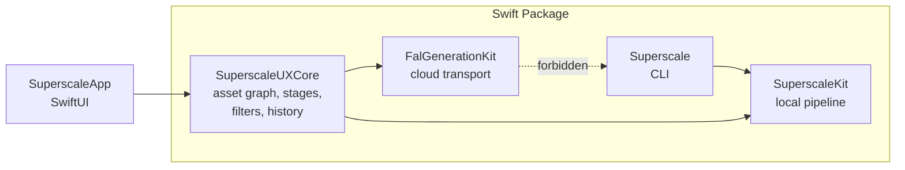
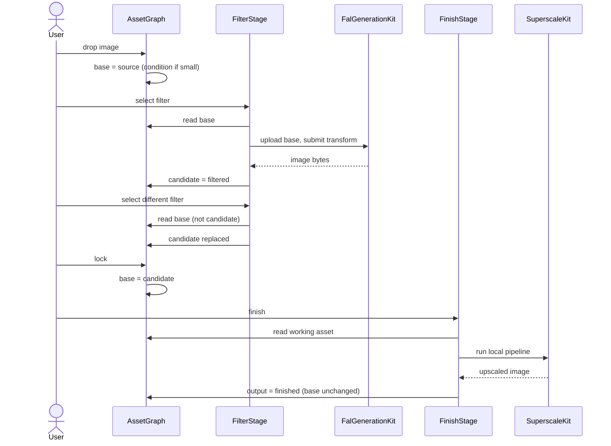

<!-- Version: 3.0 | Last updated: 2026-08-20 -->

# Superscale v2: Solution Design and Implementation Guide

Superscale is a working macOS app that upscales images locally on the Neural
Engine. v2 puts a library of 86 curated AI filters in front of that upscaler.

This is the single design document for the uplift. Wire-level FAL detail is in
the [FAL request reference](FAL_REQUEST_REFERENCE.md); the original upscaler
design is in [v1](v1/).

---

## 1. What We Are Building

**Curated artistic filters, finished at high resolution by native on-device
upscaling.**

Drop a photograph, choose "Film Noir", get a 4096-pixel noir print.

Superscale v2 is **a creative tool built on an image-generation API client**.
The client is not the product; the value added on top of it is.

That value is two things. **The curated filters** carry the artistic intent ---
86 of them, each a considered piece of direction rather than a blank prompt box.
**The native finish** turns a roughly 1024-pixel API response into a deliverable
at full resolution, locally, in seconds. A cloud filter alone gives you
something too small to use. An upscaler alone gives you a bigger version of what
you already had. Together a photograph becomes a print.

Creative intent runs through the whole app, not just the cloud half: choosing
the filter, adjusting its wording, deciding what to lock, selecting the upscale
model and scale, and judging the result are all creative decisions the app
exists to serve.

The 86 filters in `Sources/SuperscaleUXCore/Resources/PromptPacks/` are
**built-in**, owned by this repository. Their text is **editable at runtime,
before the API call is made**; in the v2 MVP those edits apply to that run only
and are **not saved**.

### Direction of travel

The MVP is **filter-first**: every journey starts from an image the user brings
in. The next version adds **generation from a named prompt with no source
image**, moving the app closer to what the `pix` CLI does while keeping the
filters and the native finish as the reason to use it.

The architecture below accommodates that deliberately rather than deferring it
blindly: the filter format already declares `requiresInput`, and the
asset model already treats a `source` as something that may be created rather
than imported. Adding free-form generation should be a new way to produce a
source, not a redesign.

What v2 is still not: an image editor, or an asset manager.

---

## 2. Functionality

### 2.1 The core journey

1. The user brings in an image --- drag and drop, open, or paste. It becomes the
   **base**.
2. **It upscales immediately**, using the selected upscale model and scale: 2x,
   4x, 8x or a custom resolution. This is v1 behaviour and it is the default.
   Deselecting the scale turns it off (2.5).
3. The user clicks a filter. Its text loads into an editable area --- **no API
   call, no cost**. They can read it, adjust it, or click through others freely.
4. **Apply** executes the call and produces the **candidate**. If a scale is
   selected the upscale re-runs on it, so the user sees a finished result.
   Applying again, with any filter, reads the base and replaces the candidate.
   Filters do not stack by accident.
5. When the user likes a result they can **lock** it, making it the new base so
   further filters build on it.
6. **Save** writes the finished image where the user chooses.

**Finishing is reactive, not a step the user takes.** v1 already works this way:
changing the scale or model re-runs the upscale. v2 extends it --- the upscale
re-runs whenever the working image changes or the scale or model changes, and
does nothing at all when the scale is deselected. A user who only wants v1 drops
an image and it upscales, exactly as before. A filter-first user deselects the
scale, explores filters, and selects a scale when ready.

### 2.2 Bringing in an image

Accepts PNG, JPEG, TIFF and HEIC via drag and drop, the open panel, or paste.
One image at a time; this is not a batch tool. The image's true pixel dimensions
are read and shown, and it becomes the base with role `source`.

The MVP has no "generate from a prompt" entry, because the filter corpus is
built for transformation: 60 of the 86 carry preserve clauses and 50 explicitly
transform "the input image". Every MVP journey therefore starts from an image
the user brings in.

Generation from a named prompt is the **next version**, not a permanent
exclusion. When it arrives it becomes an additional way to create a `source`
asset, entering the same pipeline at the same point as an imported image, with
conditioning, filtering and finishing unchanged downstream.

### 2.3 Choosing and applying a filter

Applying a filter costs money, so selecting one must not. The interaction is
**two steps, deliberately**.

**Step one --- select (free).** The filter list is the primary surface: 86 filters
grouped by category (lighting, print, sketch, material, illustration, design,
media, zeitgeist), searchable by name. Clicking one loads its text into an
editable text area. **No API call is made.** The user can read the filter, see
exactly what will be sent, and click through as many as they like at no cost.

**Step two --- edit and execute (paid).** The text area is editable ad hoc: the
user may adjust the wording, or send it untouched. A distinct **Apply** button
executes the API call and produces the candidate. The estimated cost sits beside
that button, and running session spend is visible.

There is no auto-apply on selection. It would turn an exploratory session into
an expensive one. Auto-apply may be offered later as an explicit opt-in, but it
is not the default and is not in the MVP.

**Edits are not saved in the v2 MVP.** They apply to that execution only, do not
modify the built-in filter, and do not persist across selections or sessions.
Saving user-authored filters is deferred.

Other rules:

- Filters declaring `requiresInput` are not applicable without a base.
- The **model** must accept a reference image. Only reference-capable models are
  selectable for filtering. This is a property of the model, not the filter --- a
  filter is plain prompt text and works with any model that takes an image.
- Applying is cancellable while in flight.

**Comparison** is available throughout, reusing the existing magnifier loupe and
slider views: base against candidate after applying, and pre-finish against
finished afterwards.

### 2.4 Lock

**Lock** is the only action that moves the base. It promotes the current
candidate, so subsequent filters build on top of it. That is how deliberate
stacking is expressed --- noir *then* woodblock, rather than woodblock instead of
noir.

Because a filter always reads the base, switching filters compares them against
the user's photograph rather than against each other's output. Lock is
unmistakable in the interface, because it is the one action that changes what
subsequent filters consume.

The base is never a finished image, so it is always valid filter input.

### 2.5 Finishing

Finishing runs the existing local pipeline: content-based model auto-selection
or an explicit choice from the seven Real-ESRGAN models, a scale factor or
target dimensions, and optional face enhancement.

**It is reactive.** The user does not invoke it; it runs whenever there is a
scale selected and something to run on, which is how v1 already behaves.

- It reads the working image --- the candidate if one exists, otherwise the base.
- It re-runs when the working image changes (a filter applied, a candidate
  locked) or when the scale or model changes.
- It **produces an output without advancing state**, so the user can look at a
  finished result and carry on trying filters.
- Each run derives from the working image and writes a **new** file. It never
  re-processes its own output and never overwrites a previous result.
- Progress is reported per stage, and it is **cancellable** --- it is the long
  local operation.
- Output above 4096 pixels on the long edge warns; above 8192 it is refused.
  The reason is memory, quantified in section 3.8.

#### Automatic finishing, and turning it off

In v1, dropping an image **upscales it immediately** at whatever scale is
selected, and changing the scale or model re-runs it. That immediacy is the v1
experience and is kept.

It needs an off switch in v2. In a filter-first session the user usually wants
to filter before finishing, and auto-finishing on import spends roughly three
seconds of model load plus processing on an output they are about to set aside.

**Toggling off is done by deselecting the active scale button.** The scale
control (2x, 4x, 8x, custom) becomes a proper toggle group: clicking the
selected button clears it, and with nothing selected there is no finish. Drop an
image with scale off and it simply becomes the base, ready to filter. Select a
scale later and finishing runs then.

This needs an **off state in `ScaleMode`**, which today is only `.preset(Int)`
or `.custom`, and buttons that clear rather than re-select when the active one is
pressed.

Correctness does not depend on this. The invariants already guarantee a filter
reads the base, so even an auto-finished image is never filtered. The toggle is
about wasted work and user control, not safety.

#### Minimum resolution for filtering

An **edge case**, not a step in the journey. If the image the filter would
receive is below the filter model's working resolution, it is too small to
transform well.

The app handles it automatically: it upscales to the minimum required and shows
an unobtrusive message saying it did so. The user is not asked and not blocked.

The user may still change the upscale model and amount freely. **Whenever a
change would drop the image below the minimum, it is raised again and the
message is shown again.** The floor is enforced continuously, not just on
import.

This is a distinct operation from finishing: it targets the model's working
resolution rather than the user's chosen output size, and its result is valid
filter input where a finished image is not.

**Face enhancement is unchanged from v1.** GFPGAN is not bundled, because of its
non-commercial licence. It is present only if the user deliberately downloaded
it through the licence-acceptance flow, or it is already on the system. When it
is absent the option is simply unavailable, and the pipeline skips the stage.
The toggle's default follows installation state, and the pipeline guards on both
the toggle and installation. v2 changes none of this.

### 2.6 Saving and history

Save writes to the configured output folder with a descriptive filename derived
from the source and the operation.

History records sessions --- the source, the filters applied, the finished
outputs, model and cost metadata, and timestamps. It exists for recovery and
audit, not asset management. From history a user can reopen a session, or save
and reveal an output. Secrets are never written to it.

**Local-only finishes are recorded too.** Today only cloud sessions are, which
is why History claims to show local upscales but never does.

### 2.7 Settings

Two FAL credentials with separate lifecycles, both in the Keychain:

- a **generation key** for filters, upload and pricing;
- a separate **account key** for balance and billing, which never falls back to
  the generation key.

This is a standing least-privilege principle across the project's API
integrations, not a FAL-specific choice: the key used constantly is the most
exposed, so it must not also read billing.

Non-secret settings: default upscale model, default filter model, output folder,
and the cost-confirmation threshold. The default upscale model applies to every
finish, including a plain dropped file.

### 2.8 Degraded states

The app must remain useful when parts are unavailable.

| Condition | Behaviour |
|---|---|
| No generation key | Filters unavailable with a route to Settings. **Local upscaling works fully.** |
| No or unauthorized account key | Balance hidden. Filters and pricing unaffected. |
| Pricing unavailable | Filter still offered; cost shown as unavailable and the confirmation policy applies rather than a guessed figure. |
| Network failure | Reported against the filter stage. The base and any candidate survive. |
| Provider rejects the request | The provider's reason is surfaced in readable form, secrets redacted. |
| Local pipeline failure | Reported against the finish stage; the working image survives. |

Cloud actions are visibly distinct from local ones. Local finishing never leaves
the machine and that stays true; applying a filter uploads the image, and that
is stated where the action happens, not buried in settings.

---

## 3. Architecture

### 3.1 Modules



| Module | Owns |
|---|---|
| `SuperscaleKit` | Tiling, Core ML inference, model registry and cache, alpha, face enhancement, image I/O. No knowledge of the cloud. |
| `FalGenerationKit` | FAL transport, model registry, per-family request handlers, reference upload, pricing, account, error parsing, fixtures. |
| `SuperscaleUXCore` | The asset graph, the three stages, the filter catalogue, session history, settings, storage policy. |
| `SuperscaleApp` | SwiftUI views and platform integration only. |
| `Superscale` | The CLI. Local upscaling only, with no dependency on the two cloud-facing modules. Verified by test. |

One correction to the current layout: `V2AppPaths` lives inside
`GenerateView.swift` while the app entry point depends on it. Storage policy
belongs in `SuperscaleUXCore`.

### 3.2 The asset model

Every image is an asset with a role and a parent. This is what makes the rules
in section 2 structural rather than remembered.

```swift
public enum AssetRole: String, Sendable {
    case source        // brought in by the user
    case conditioned   // pre-upscaled to reach model resolution
    case filtered      // output of a filter
    case finished      // output of the terminal upscale
}

public struct Asset: Identifiable, Sendable {
    public let id: UUID
    public let role: AssetRole
    public let fileURL: URL
    public let pixelSize: CGSize
    public let parentID: UUID?          // lineage
    public let provenance: Provenance?  // filter, model, prompt, cost — never secrets
}
```

An `AssetGraph` owns the assets, the **base** pointer and the **candidate**
pointer, and is the only place these rules live:

| | Invariant |
|---|---|
| **I1** | A `finished` asset is never input to any stage. |
| **I2** | Filters read the base --- never the candidate, never a finished asset. |
| **I3** | Every filter application reads the base and replaces the candidate. Results never chain implicitly. |
| **I4** | Only an explicit lock moves the base, and never to a finished asset. |
| **I5** | Finishing derives from the working asset and writes a new file. It never consumes or overwrites a previous finished output. |
| **I6** | A finished asset is attributed to a session only if it descends from that session's lineage. Never by timing. |

Each is pure logic over the graph, testable with no network and no Core ML.

### 3.3 Stages

Local and cloud work take the same shape, so the app has one progress model, one
cancellation model, and one error path:

```swift
protocol Stage {
    associatedtype Options
    func run(input: Asset, options: Options,
             progress: @Sendable (StageProgress) -> Void) async throws -> Asset
}
```

`ConditionStage` and `FinishStage` wrap `SuperscaleKit`; `FilterStage` wraps
`FalGenerationKit`. Today the cloud path has a phase enum and cancellation while
the local path has a boolean and none; this collapses that asymmetry.

### 3.4 Flow



### 3.5 The filter catalogue

The corpus is vendored --- copied once, owned here, with nothing referring to an
external directory. Metadata lives in frontmatter so each filter is
self-contained:

```markdown
---
id: lighting-film-noir
name: Film Noir
category: Lighting
requiresInput: true
aspect: preserve
---
Transform the input image using film noir lighting.
Preserve the subject's identity, pose, expression, clothing, camera angle...
```

This replaces deriving metadata by splitting filenames, which has nowhere to
record whether a filter needs an input image.

The fields are deliberately few. **A filter is prompt text, not a
configuration.** It carries no model list and no compatibility declaration,
because there is no such thing as a filter that suits one image-edit model and
not another --- any model that accepts a reference image can run any filter.
`requiresInput` is the one real constraint, and it distinguishes a transform
("Transform the input image...") from a filter whose body is a pure style
description and could seed generation once that path exists.

**Body convention**, following the strongest existing filters: transform
instruction, preserve clause, style direction, intended feel, avoid clause. No
markdown headers --- validated at load.

### 3.6 Cloud integration

Detail is in the [FAL request reference](FAL_REQUEST_REFERENCE.md). Design
points:

- **Image-to-image is the primary path** for the MVP. The text-to-image path is
  the next version, so handlers and the model registry carry both modes from the
  start rather than being retrofitted.
- **The base is uploaded to FAL storage and passed as a URL.** This replaces the
  base64 data-URI encoding currently in a view. Upload belongs in
  `FalGenerationKit`. Uploaded URLs expire at the provider's discretion and are
  **never cached**.
- **Model-family differences live in declarative handlers** with an explicit
  edit-sibling map, not a naive `<model>/edit` rule, which 404s for several
  families.
- **Errors are parsed through the multi-envelope parser** --- gateway shape,
  top-level message, FastAPI `detail` as string or list --- then mapped to the
  taxonomy, redacted, and truncated so an echoed payload cannot flood a
  diagnostic.
- **Pricing and account are best-effort and independent.** Neither blocks a
  filter; a failure in one does not suppress the other. Results are cached for
  the session, including negatives.
- **Edit endpoints often ignore the requested aspect ratio**, so filter output
  is centre-cropped back to the base's aspect with a small tolerance.

### 3.7 Storage

Assets live in app-managed storage as plain files plus JSON metadata; no
database. A session record links source, filters applied, finished outputs,
model and cost metadata, and timestamps. Each finished asset gets its own path
derived from its identity, which is what makes I5 hold.

### 3.8 Constraints inherited from the kit

These shape the design and are not discovered late.

- **Memory is the binding limit.** `Tiler.stitch` allocates roughly 36 bytes per
  output pixel, all resident: 4096² is about 600 MB, 8192² about 2.4 GB. Tile
  size does not help --- it affects the inference working set, never the stitch
  buffer. Hence the caps in 2.5. The natural design point, a 1024-pixel filter
  output at 4×, lands at 4096.
- **No in-memory entry point** --- the pipeline is URL to URL, which suits the
  asset graph since it persists assets anyway.
- **Model load costs about 3.2s per call**, because `Pipeline` is not `Sendable`
  and a fresh one is built each time. Conditioning plus finishing would pay it
  twice.
- **Progress is unstructured strings**, and the GUI currently parses face counts
  out of message text.
- **No cancellation exists** in the kit.

The last three, plus `LocalizedError` conformance, are `SuperscaleKit` changes.
They are authorized.

### 3.9 Interface

The pipeline implies a workspace rather than four peer modes: a canvas showing
the working image, the filter list, a lock control, finish controls, and a
lineage indicator.

**Merging Upscale and Generate into one Studio surface is the recommendation**,
with History and Settings retained separately. It is **out of scope below** and
remains open --- the defects are data-model defects and are fixed either way.

---

## 4. What Exists Today

**The v1 foundation is sound and stays.** `SuperscaleKit` is dependency-free
with a pinned public API: tiling, Core ML inference, seven models with
content-based auto-selection, a compiled-model cache, alpha handling, and an
SSIM gate against PyTorch references. The app has drag and drop, a magnifier
loupe, a slider comparison with zoom and minimap, an info panel, and a
face-model licence flow.

**The v2 cloud work is built but bolted alongside.** The clients, Keychain
credentials, filter loading, session store and coordinator are sound components.
They form a parallel app sharing a window: four peer modes, no shared state
between `GenerateView` and `UpscaleViewModel`, and a handoff that is a bare URL
plus a `UUID` in view-local `@State`.

The telling detail: **the integration API already exists and is dead code.**
`GUIUpscaleSource` distinguishes `.selectedFile` from `.generatedFile`,
`GUIUpscaleResult` carries that provenance back, and both
`GenerationCoordinator.upscaleSource` and
`GenerationSessionRecord.upscaleSource` exist to carry it across the seam. None
is called. Section 3.2 revives it.

## 5. Defects

| | Severity | Defect |
|---|---|---|
| **D1** | data loss | History "Send to Upscale" passes `preferredAssetURL` (`upscaledAssetURL ?? generatedAssetURL`), so an already-upscaled session re-upscales its own output and overwrites the original at the fixed `upscaled.<ext>` path. The correct accessor sits unused three lines above. |
| **D2** | data corruption | The write-back observer fires on any `resultData` change while `pendingSessionID` is set, so dropping an unrelated file after a handoff attributes that file's upscale to the cloud session. |
| **D3** | confirmed, medium | **Every output has a one-pixel black border.** `Tiler.blendWeight` returns `min(left, right, top, bottom)`; at `x=0` that is zero, so edge pixels accumulate zero weight and keep their initialized zero (`Tiler.swift:156`). Measured on `Tests/visual_output/remy1_4x.png`: outermost row and column 100% black, inner rows 0%, source 0%. RT-087 misses it by sampling 20px inside. Affects every image v1 has produced. |
| **D4** | medium | 3 of 86 filters begin with a markdown header containing their filename, which is sent to the provider as prompt text. |
| **D5** | medium | Kit errors are not `LocalizedError`, so the GUI shows "The operation couldn't be completed. (SuperscaleKit.ImageIOError error 0.)" |
| **D6** | medium | The upscale has no cancellation at any level, though it is the long local operation. |
| **D7** | low | `pendingSessionID` is never cleared on mode switch or new drop. |
| **D8** | low | `defaultUpscaleModelID` is honoured on the handoff path but not on drop. |

---

## 6. Delivery

Nine slices. Each is independently testable and becomes a ticket.

| | Slice | Content |
|---|---|---|
| 1 | **Asset graph** | `Asset`, `AssetRole`, lineage, base/candidate/lock. Enforce I1--I6. Revive the dead provenance API. Closes D1, D2, D7. First, because it stops active data loss. |
| 2 | **Stages** | The `Stage` protocol and `StageProgress`; local and cloud behind one shape; one progress and cancellation model. Adds the off state to `ScaleMode` and makes the scale buttons a true toggle group, so automatic finishing on import can be turned off (2.5). |
| 3 | **Kit extensions** | Structured progress, cancellation in the tile loop, actor-confined reusable `Pipeline`, `LocalizedError`. **Fix D3**, with a regression test sampling the outermost row and column. Closes D3, D5, D6. Must not regress the SSIM gate. |
| 4 | **Filter catalogue** | Frontmatter across all 86, a parser replacing filename-splitting, load validation, clean the 3 polluted bodies, the two-step select-then-apply flow with its editable text area. Closes D4. |
| 5 | **Reference upload** | FAL storage upload returning URLs, in `FalGenerationKit`, replacing base64. |
| 6 | **Registry and handlers** | Declarative per-family handlers, edit-sibling map, safety and required fields, argument precedence, aspect snapping. |
| 7 | **Conditioning** | Automatic pre-upscale below model resolution, with the resolution caps applied and reported. |
| 8 | **Errors** | Multi-envelope parser, mapped taxonomy, redaction, one presentation surface replacing four. |
| 9 | **Pricing and account** | Independent best-effort fetches, session caching including negatives, non-fatal degradation. Closes D8. |

Excluded and following separately: the interface change (3.9), output fidelity
polish, and release hardening.

## 7. Testing

**A test exercises the entry point a user would.** A test that reads a project
file and asserts its text contains a sentence is not a test --- it pins prose,
breaks when a file moves, and stays green while the system misbehaves. Eight
such tests have been removed. CLI stdout and stderr are a legitimate assertion
target, because they are the CLI's interface; documents, Makefiles and scripts
are not.

| Surface | Approach |
|---|---|
| Invariants I1--I6 | Direct unit tests over the asset graph. Attempting to filter a finished asset must be impossible or must throw. No network, no Core ML. |
| Request construction | Pure functions --- handler selection, edit-sibling resolution, aspect snapping, prompt composition --- tested with no network. The highest-value surface in both reference implementations. |
| Transport | Stubbed with `URLProtocol`: response parsing, pricing, account, upload, and every error envelope. **No test calls a paid endpoint.** |
| Stage behaviour | Through `GUIUpscaleProcessing` with a stub processor, so lineage and handoff are verified without Core ML. |
| Pipeline output | Image assertions on real output, including the outermost row and column. |
| Quality | The SSIM gate against PyTorch references. **Required on slice 3**, which touches the v1 core. |
| Secrets | Asserted absent from every diagnostic and persisted record. |
| Human | One filter applied to a real image, one pricing check, one finished output saved. Charges may apply. |

## 8. Status and Open Items

Superseded tickets #70--#78 are closed; a fresh tree is raised from section 6.
Legacy tickets #55, #57, #66 and #69 remain valid and untouched. The regression
suite passes.

Open, not blocking:

- **Interface structure** (3.9). Merge into one Studio workspace, or keep four
  modes with a corrected model beneath. Recommendation: merge.
- **Filter corpus revision.** 26 of 86 filters lack a preserve clause and read as
  style prompts rather than transforms. Authorial work.
- **The README** states images never leave the machine. True of local finishing,
  false once filtering ships. Needs correcting before release.

## Changelog

- **3.0 (2026-08-20):** Added the functionality specification (journeys, filter
  browsing, lock, finishing, history, settings, degraded states) and expanded
  the architecture with module responsibilities, flow, storage and the testing
  contract.
- **2.0 (2026-08-20):** Rewritten as a single solution design.
- **1.0 (2026-08-20):** First issue.
