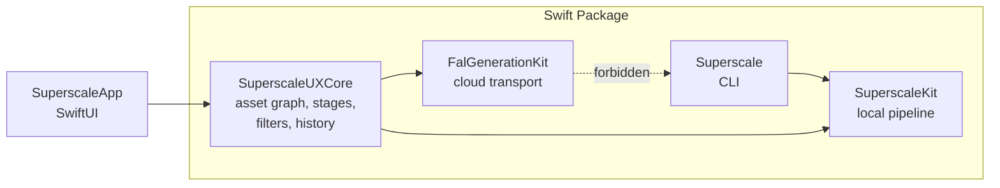
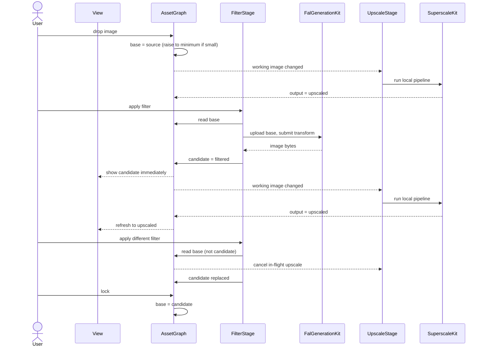

<!-- Version: 3.7 | Last updated: 2026-08-25 -->

# Superscale v2: Solution Design and Implementation Guide

Superscale is a working macOS app that upscales images locally on the Neural
Engine. v2 puts a library of 86 curated AI filters in front of that upscaler.

This is the single design document for the uplift. Wire-level FAL detail is in
the [FAL request reference](FAL_REQUEST_REFERENCE.md); the original upscaler
design is in [v1](v1/).

---

## 1. What We Are Building

**Curated artistic filters, taken to full resolution by native on-device
upscaling.**

Drop a photograph, choose "Film Noir", get a 4096-pixel noir print.

Superscale v2 is **a creative tool built on an image-generation API client**.
The client is not the product; the value added on top of it is.

That value is two things. **The curated filters** carry the artistic intent ---
86 of them, each a considered piece of direction rather than a blank prompt box.
**The native upscale** turns a roughly 1024-pixel API response into a deliverable
at full resolution, locally, in seconds. A cloud filter alone gives you
something too small to use. An upscaler alone gives you a bigger version of what
you already had. Together a photograph becomes a print.

Creative intent runs through the whole app, not just the cloud half: choosing
the filter, adjusting its wording, deciding what to lock, selecting the upscale
model and scale, and judging the result are all creative decisions the app
exists to serve.

The 86 filters in `Sources/SuperscaleUXCore/Resources/PromptPacks/` are
**built-in**, owned by this repository. Their text is **editable at runtime,
before the API call is made**; in the v2 MVP those edits apply to that run only
and are **not saved**.

### What the MVP is for

**To put a coherent, working UX in front of human eyes so it can be refined.**
Not to be feature-complete.

That purpose decides the scope. One model (`xai/grok-imagine-image/edit`), no
generation from a bare prompt, no user-saved filters, no interface rebuild.
Each is deferred not because it is hard but because none of them is needed to
judge whether the core loop --- bring in an image, try filters, lock what works,
upscale, save --- feels right. Anything that does not serve that judgement is
work done before it can be evaluated.

### Direction of travel

The MVP is **filter-first**: every journey starts from an image the user brings
in. The next version adds **generation from a named prompt with no source
image**, moving the app closer to what the `pix` CLI does while keeping the
filters and the native upscale as the reason to use it.

The architecture below accommodates that deliberately rather than deferring it
blindly: the filter format already declares `requiresInput`, and the
asset model already treats a `source` as something that may be created rather
than imported. Adding free-form generation should be a new way to produce a
source, not a redesign.

What v2 is still not: an image editor, or an asset manager.

---

## 2. Functionality

### 2.1 The core journey

1. The user brings in an image --- drag and drop, open, or paste. It becomes the
   **base**.
2. **It upscales immediately**, using the selected upscale model and scale: 2x,
   4x, 8x or a custom resolution. This is v1 behaviour and it is the default.
   Deselecting the scale turns it off (2.5).
3. The user clicks a filter. Its text loads into an editable area --- **no API
   call, no cost**. They can read it, adjust it, or click through others freely.
4. **Apply** sends **the base** --- the image as it stands, never an upscaled
   version of it --- to the API. The **candidate** comes back and is shown **the
   moment the API returns**, before any upscaling. The local upscale then starts
   on it, and the view refreshes to the upscaled version when it completes.
   Applying again, with any filter, sends the base again and replaces the
   candidate. Filters do not stack by accident.
5. When the user likes a result they can **lock** it, making it the new base so
   further filters build on it.
6. **Save** writes the upscaled image where the user chooses.

**Upscaling is reactive, not a step the user takes.** v1 already works this way:
changing the scale or model re-runs the upscale. v2 extends it --- the upscale
re-runs whenever the working image changes or the scale or model changes, and
does nothing at all when the scale is deselected. A user who only wants v1 drops
an image and it upscales, exactly as before. A filter-first user deselects the
scale, explores filters, and selects a scale when ready.

### 2.2 Bringing in an image

Accepts PNG, JPEG, TIFF and HEIC via drag and drop, the open panel, or paste.
One image at a time; this is not a batch tool. The image's true pixel dimensions
are read and shown, and it becomes the base with role `source`.

The MVP has no "generate from a prompt" entry, because the filter corpus is
built for transformation: 60 of the 86 carry preserve clauses and 50 explicitly
transform "the input image". Every MVP journey therefore starts from an image
the user brings in.

Generation from a named prompt is the **next version**, not a permanent
exclusion. When it arrives it becomes an additional way to create a `source`
asset, entering the same pipeline at the same point as an imported image, with
filtering and upscaling unchanged downstream.

### 2.3 Choosing and applying a filter

Applying a filter costs money, so selecting one must not. The interaction is
**two steps, deliberately**.

**Step one --- select (free).** The filter list is the primary surface: 86 filters
grouped by category (lighting, print, sketch, material, illustration, design,
media, zeitgeist), searchable by name. Clicking one loads its text into an
editable text area. **No API call is made.** The user can read the filter, see
exactly what will be sent, and click through as many as they like at no cost.

**Step two --- edit and execute (paid).** The text area is editable ad hoc: the
user may adjust the wording, or send it untouched. A distinct **Apply** button
executes the API call and produces the candidate. The cost sits beside that
button, and running session spend is visible.

Cost is a **known flat rate** for the MVP --- grok is 2c per image --- held as a
documented constant. There is no pricing API call. A live pricing client returns
when a second model makes a flat rate untenable.

There is no auto-apply on selection. It would turn an exploratory session into
an expensive one. Auto-apply may be offered later as an explicit opt-in, but it
is not the default and is not in the MVP.

**Edits are not saved in the v2 MVP.** They apply to that execution only, do not
modify the built-in filter, and do not persist across selections or sessions.
Saving user-authored filters is deferred.

**The MVP ships one model: `xai/grok-imagine-image`.** There is no model picker
to reason about. Every filter runs against it, using its edit endpoint
(`xai/grok-imagine-image/edit`) because every MVP filter takes an input image.

Other rules:

- Filters declaring `requiresInput` are not applicable without a base.
- Any model offered for filtering must accept a reference image. That is a
  property of the model, not the filter --- a filter is plain prompt text and
  works with any model that takes an image. It becomes a real constraint only
  when a second model is added.
- Applying is cancellable while in flight.

**Comparison** is available throughout, as a curtain drawn across the image: base
against candidate after applying, and pre-upscale against upscaled afterwards.
The magnifier loupe that once shared this role is removed by slice 9c --- it is a
custom cursor and reads as brittle in use, and the curtain is the instrument this
comparison wants. The divider follows the pointer within the picture's own
displayed frame, which is not the same rectangle as the window.

### 2.4 Lock

**Lock** is the only action that moves the base. It promotes the current
candidate, so subsequent filters build on top of it. That is how deliberate
stacking is expressed --- noir *then* woodblock, rather than woodblock instead of
noir.

Because a filter always reads the base, switching filters compares them against
the user's photograph rather than against each other's output. Lock is
unmistakable in the interface, because it is the one action that changes what
subsequent filters consume.

**Lock always captures the image at model resolution, never its upscale.** The
upscale is a deterministic local derivation: given the same image, model and
scale it can be reproduced at any time in seconds. There is nothing to preserve
by locking it, and locking it would put oversized pixels in front of the next
filter. So what is locked is the filter's own output, or --- in the
minimum-resolution case --- the source raised to the assumed minimum.

This is why the base is always valid filter input, and it is the whole reason
the invariants in 3.2 hold without special cases.

#### Locked iterations

Locking does not discard what came before. Each lock extends a chain, and the
user can **scroll back through previously locked iterations**, view any of them,
and **save any of them**.

Saving an earlier iteration upscales it on demand at the current settings,
because the upscale is deterministic and need not have been kept. This is what
makes discarding upscales at lock time safe rather than lossy.

The chain is the lineage the asset graph already records, so this needs no
separate history structure: walking back through locked iterations is walking
the parent chain of the current base.

### 2.5 Upscaling

Upscaling runs the existing local pipeline: content-based model auto-selection
or an explicit choice from the seven Real-ESRGAN models, a scale factor or
target dimensions, and optional face enhancement.

**It is reactive.** The user does not invoke it; it runs whenever there is a
scale selected and something to run on, which is how v1 already behaves.

**It never blocks the view of a filter result.** The API round trip is already
slow, and the upscale adds processing on top of it --- plus roughly three seconds
of model load, on the first run for a given model and setting. A
`PipelineCache` actor holds the loaded pipeline afterwards, so that load is not
paid again while it is held. Stacking even the processing means a wait before
the user sees anything, on the one decision they most want fast feedback about:
did the filter work.

So the candidate is **displayed as soon as the API returns**, at model
resolution. The upscale starts after that and the view **refreshes
asynchronously** to the upscaled version when it completes, with an unobtrusive
indication that it is running. The user judges the creative result immediately
and gets the quality shortly after.

This falls out of upscaling producing an output without advancing state: the
candidate stays the candidate, and the upscaled image is a rendering of it that
arrives late. Applying another filter mid-upscale cancels it, because the
working image has changed.

- It reads the working image --- the candidate if one exists, otherwise the base.
- It re-runs when the working image changes (a filter applied, a candidate
  locked) or when the scale or model changes.
- It **produces an output without advancing state**, so the user can look at a
  upscaled result and carry on trying filters.
- Each run derives from the working image and writes a **new** file. It never
  re-processes its own output and never overwrites a previous result.
- Progress is reported per stage, and it is **cancellable** --- it is the long
  local operation.
- Output is bounded at **32 megapixels of area**, not by edge length. Beyond it
  the scale is reduced to the largest that fits, a custom target is reduced
  proportionally, and the reduction is reported; a picture that fits at no scale
  is left as it is, with the reason given. The reason is memory, quantified in
  section 3.8.

  **The unit matters.** The bound was previously a long edge --- a warning above
  4096 and a refusal above 8192 --- which says nothing about area: 8192 x 8192 is
  67 megapixels and about 2.4 GB, while 8192 x 1000 is 8 megapixels and about
  300 MB. The rule treated those two alike, and a 2000-pixel-wide picture at 4x
  produces 8000 on the long edge, which sat between the two thresholds:
  permitted, and fatal. Corrected by #91.

  **The scale selection is not rewritten by a reduction.** AC82.8 holds that it
  changes only when the user changes it, so the control keeps showing what was
  asked for and the message reconciles it with what ran.

  **The minimum long edge of 2.5 is unaffected.** A floor expressed as an edge
  and a ceiling expressed as an area answer different questions: whether a
  picture is large enough for the provider to work with, and whether its output
  fits in memory.

#### Automatic upscaling, and turning it off

In v1, dropping an image **upscales it immediately** at whatever scale is
selected, and changing the scale or model re-runs it. That immediacy is the v1
experience and is kept.

It needs an off switch in v2. In a filter-first session the user usually wants
to filter before upscaling, and auto-upscaling on import spends processing --- and
on the first run, roughly three seconds of model load --- on an output they are
about to set aside. The cache removes the repeat cost, not the first one, so the
argument for the switch stands: a filter-first user does not want that upscale at
all, however cheap the second would be.

**Toggling off is done by deselecting the active scale button.** The scale
control (2x, 4x, 8x, custom) becomes a proper toggle group: clicking the
selected button clears it, and with nothing selected there is no upscale. Drop an
image with scale off and it simply becomes the base, ready to filter. Select a
scale later and upscaling runs then.

This needs an **off state in `ScaleMode`**, which today is only `.preset(Int)`
or `.custom`, and buttons that clear rather than re-select when the active one is
pressed.

Correctness does not depend on this. The invariants already guarantee a filter
reads the base, so even an auto-upscaled image is never filtered. The toggle is
about wasted work and user control, not safety.

#### Minimum resolution for filtering

An **edge case**, not a step in the journey. An image can be too small to give a
filter enough to work with.

**The minimum is 1024 pixels on the long edge.**

This is an assumption, not a published figure: FAL does not document a minimum
input size per model, and it varies. It is held in **one named constant**, and
is revisable if real usage says otherwise. Long edge rather than a fixed
width and height, so portrait, landscape and square are all covered without
baking in an aspect ratio.

The supporting evidence is indirect: `pix` maps its aspect presets to sizes
around `1536x1024`, and `storyboard-gen` prices on roughly one megapixel per
image, which `1024x1024` matches. Both indicate the scale these models work at.

A per-model override belongs in the model registry if a provider ever documents
a real figure.

It needs no special machinery. The app performs the sequence the user could have
performed by hand:

1. **Import** the small image.
2. **Upscale** it to the minimum required.
3. **Lock** that result, so it becomes the base.
4. **Turn the upscale toggle off.**

An unobtrusive message says the image was raised to the minimum size for
filtering. From that point the session is completely ordinary: the base is a
normal base, filters read it as usual, and the user can turn the scale back on
whenever they want a final upscale.

Turning the toggle off matters. Without it the app would keep re-upscaling an
image that is already at the size the filter wants, spending time on work that
is immediately discarded.

The user may still change the upscale model and amount freely. **Whenever a
change would drop the image below the minimum, it is raised again and the
message is shown again.** The floor is enforced continuously, not only on
import.

**Face enhancement is unchanged from v1.** GFPGAN is not bundled, because of its
non-commercial licence. It is present only if the user deliberately downloaded
it through the licence-acceptance flow, or it is already on the system. When it
is absent the option is simply unavailable, and the pipeline skips the stage.
The toggle's default follows installation state, and the pipeline guards on both
the toggle and installation. v2 changes none of this.

### 2.6 Saving and session history

Save writes to the configured output folder with a descriptive filename derived
from the source and the operation. Any locked iteration can be saved, not only
the current one (2.4).

**There is no History workspace.** What a user wants mid-session is the locked
iterations, and those live in the sidebar. Reaching an older piece of work is
what **`File > Open Recent`** is for --- the native Mac answer, and enough.

A session record still exists on disk for recovery and audit: the source, the
filters applied, the outputs, model metadata and timestamps. Secrets are never
written to it. **Local-only upscales are recorded too**, which today they are
not.

### 2.7 Settings

Settings is a real macOS `Settings` scene on `Cmd+,`, not a workspace.

One FAL credential is required for the MVP: a **generation key**, held in the
Keychain, used for filters and upload.

A separate **account key** for balance and billing exists in the codebase and is
retained, but no MVP feature uses it, because pricing and account visibility are
paused (see 6). When they return, the standing rule applies: the privileged key
never falls back to the everyday one. That is a least-privilege principle across
the project's API integrations, not a FAL-specific choice --- the key used
constantly is the most exposed, so it must not also read billing.

Non-secret settings: default upscale model and output folder. The default
upscale model applies to every upscale, including a plain dropped file.

### 2.8 Degraded states

The app must remain useful when parts are unavailable.

| Condition | Behaviour |
|---|---|
| No generation key | Filters unavailable with a route to Settings. **Local upscaling works fully.** |
| Network failure | Reported against the filter stage. The base and any candidate survive. |
| Provider rejects the request | The provider's reason is surfaced in readable form, secrets redacted. |
| Local pipeline failure | Reported against the upscale stage; the working image survives. |

Cloud actions are visibly distinct from local ones. Local upscaling never leaves
the machine and that stays true; applying a filter uploads the image, and that
is stated where the action happens, not buried in settings.

---

## 3. Architecture

### 3.1 Modules



| Module | Owns |
|---|---|
| `SuperscaleKit` | Tiling, Core ML inference, model registry and cache, alpha, face enhancement, image I/O. No knowledge of the cloud. |
| `FalGenerationKit` | FAL transport, model registry, request handlers, reference upload, pricing, account, error parsing, fixtures. |
| `SuperscaleUXCore` | The asset graph, the two stages, the filter catalogue, session history, settings, storage policy. |
| `SuperscaleApp` | SwiftUI views and platform integration only. |
| `Superscale` | The CLI. Local upscaling only, with no dependency on the two cloud-facing modules. Verified by test. |

One correction to the current layout: `V2AppPaths` lives inside
`GenerateView.swift` while the app entry point depends on it. Storage policy
belongs in `SuperscaleUXCore`.

### 3.2 The asset model

Every image is an asset with a role and a parent. This is what makes the rules
in section 2 structural rather than remembered.

```swift
public enum AssetRole: String, Sendable {
    case source        // brought in by the user
    case raisedToMinimum  // raised only to the assumed minimum long edge
    case filtered      // output of a filter
    case upscaled      // output of an upscale targeting the user's chosen size
}

public struct Asset: Identifiable, Equatable, Sendable {
    public let id: UUID
    public let role: AssetRole
    public let fileURL: URL
    public let pixelSize: CGSize
    public let parentID: UUID?          // lineage
    public let provenance: Provenance?
}

public struct Provenance: Codable, Equatable, Sendable {
    public let filterID: String?
    public let modelID: String?
    public let prompt: String?   // redacted of any supplied secret
    public let sessionID: UUID?  // what session attribution walks the lineage for
}
```

An `AssetGraph` owns the assets, the **base** pointer and the **candidate**
pointer, and is the only place these rules live:

| | Invariant |
|---|---|
| **I1** | An `upscaled` asset is never input to any stage. |
| **I2** | Filters read the base --- never the candidate, never an upscaled asset. |
| **I3** | Every filter application reads the base and replaces the candidate. Results never chain implicitly. |
| **I4** | Lock captures the working image at model resolution, never its upscale. Only lock moves the base. |
| **I5** | Upscaling derives from the working asset and writes a new file. It never consumes or overwrites a previous upscaled output. |
| **I6** | An upscaled asset is attributed to a session only if it descends from that session's lineage. Never by timing. |
| **I7** | The lineage of a locked asset is retained and reachable, so any prior iteration can be viewed and saved. |

Each is pure logic over the graph, testable with no network and no Core ML.

**Upscales are derivations, not state.** An upscale is deterministic: the same
image, model and scale reproduce it in seconds. It is therefore never locked,
never part of the base chain, and never needs to be preserved. That single fact
is what makes I1, I2 and I4 hold without exceptions, and what makes discarding
an upscale safe rather than lossy.

An upscale is discarded when it is superseded: when a later upscale of the same
asset takes its place. Lock discards nothing. One output is current per working
asset, so the number retained stays proportional to the lock chain rather than
to how many times the size was adjusted, and no output is ever overwritten in
place.

**Why two upscale roles.** Both come from one `UpscaleStage`; the target decides
which:

- `raisedToMinimum` targets the assumed minimum long edge (2.5). Nothing is
  wasted by sending it, because that is the size the model wants. It is valid
  filter input and it is what lock captures in the minimum-resolution case.
- `upscaled` targets the size the user asked for. Sending it to a filter would
  discard everything the Neural Engine produced. It is terminal and is never
  locked.

The harm the invariants prevent is *exceeding* model resolution, not upscaling
as such.

**The base chain is the lock history.** Each lock creates an asset whose
`parentID` is the previous base, so walking that chain gives the locked
iterations in order. Scrolling back (2.4) is a read of the graph, not a separate
history store; saving an earlier iteration re-derives its upscale on demand.

### 3.3 Stages

Local and cloud work take the same shape, so the app has one progress model, one
cancellation model, and one error path:

```swift
protocol Stage {
    associatedtype Options
    func run(input: StageInput, output: StageOutputLocation, options: Options,
             progress: @Sendable (StageProgress) -> Void) async throws -> StageOutput
}
```

**The graph allocates; the stage writes.** A stage does not mint the asset it produces, because
the guarantee that no two upscales collide belongs to the graph: it allocates the asset and the
location, the stage writes there, and the caller records the completion against the reference the
graph already holds. Nor does a stage hand bytes back --- the image is already held in memory once,
and a 4096-pixel output is roughly 50 MB.

A run is observed as a `StageRunState`: `idle`, `running(StageProgress)`, `succeeded`, `cancelled`
or `failed(StageFailure)`. That is one model for both stages, replacing a phase enum on the cloud
side and a boolean on the local one. `StagePhase` carries the counts that belong to it --- faces
enhanced, tiles completed and total --- as numbers rather than as prose a caller has to parse.

The kit reports its own phases as `PipelineProgress`, so the stage maps case to case with no
wording involved. That was not always so: the kit first reported sentences, and the stage
recovered the structure by matching prefixes and splitting on spaces --- which meant rewording
"Enhancing 3 faces..." silently broke the face count. `PipelineProgress.description` is still that
sentence, and it is what the command-line tool prints, so the text a scripted caller reads is
unchanged while nothing depends on parsing it.

`StagePhase.unclassified` remains, and now catches a kit phase the stage does not map --- a
warning, which is a diagnostic rather than a phase, or a case a later kit version adds. It reaches
the caller with its text, so such a report degrades to plain wording rather than vanishing.

**Two stages, not three.** `UpscaleStage` wraps `SuperscaleKit` and serves both
upscale targets; `FilterStage` wraps `FalGenerationKit`. There is no separate
stage for the minimum-resolution case --- raising an image to the minimum is the
same stage with a
different target, which is why the user-visible flow is just upscale and lock.

Today the cloud path has a phase enum and cancellation while the local path has
a boolean and none; this collapses that asymmetry.

The graph publishes each stage's result as it lands, so the view can show a
candidate while its upscale is still running. `UpscaleStage` is therefore
observed independently of `FilterStage` rather than chained behind it, and a
upscale in flight is cancelled when the working image changes --- which is the
concrete reason the kit needs real cancellation (D6).

### 3.4 Flow

Upscaling is triggered by the working image changing, not by the user. Note that
the candidate is published to the view before the upscale starts.



### 3.5 The filter catalogue

The corpus is vendored --- copied once, owned here, with nothing referring to an
external directory. Metadata lives in frontmatter so each filter is
self-contained:

```markdown
---
{
  "id": "image-lighting-film-noir",
  "name": "Film Noir",
  "category": "Lighting",
  "requiresInput": true
}
---

Transform the input image using film noir lighting.
Preserve the subject's identity, pose, expression, clothing, camera angle...
```

The block is JSON rather than YAML, because `CODING.md` requires structured
data to be read by a format-aware parser and `JSONDecoder` is one in the
standard library. YAML would mean either a new dependency for four scalar
fields or a hand-rolled key-value reader, which is a line-oriented parser
wearing a schema.

All four fields are required, and the three strings must be non-empty: a name
that is present but blank decodes perfectly well and ships a blank row in the
list. A file that cannot describe itself fails the corpus rather than being
skipped, because a catalogue quietly short by one is not something anybody
counts.

This replaces deriving metadata by splitting filenames, which has nowhere to
record whether a filter needs an input image. The identifiers are unchanged ---
still the resource name --- because the GUI stores the user's default filter
under that value, and a prettier identifier would make every saved default
resolve to nothing with no error and no message.

The fields are deliberately few. **A filter is prompt text, not a
configuration.** It carries no model list and no compatibility declaration,
because there is no such thing as a filter that suits one image-edit model and
not another --- any model that accepts a reference image can run any filter.
`requiresInput` is the one real constraint, and it distinguishes a transform
("Transform the input image...") from a filter whose body is a pure style
description and could seed generation once that path exists.

**Body convention**, following the strongest existing filters: transform
instruction, preserve clause, style direction, intended feel, avoid clause, and
no markdown headers.

The convention is enforced in the corpus, not in the loader. Everything after
the closing delimiter is carried verbatim: a loader that stripped a leading
heading would satisfy every corpus test while the polluted files stayed as they
were, and would silently truncate the first filter that legitimately opened with
one. `---` is also a horizontal rule, so only the first two delimiters bound the
frontmatter.

### 3.6 Cloud integration

Detail is in the [FAL request reference](FAL_REQUEST_REFERENCE.md). Design
points:

- **Image-to-image is the primary path** for the MVP. The text-to-image path is
  the next version, so handlers and the model registry carry both modes from the
  start rather than being retrofitted.
- **The base is uploaded to FAL storage and passed as a URL.** This replaces the
  base64 data-URI encoding currently in a view. Upload belongs in
  `FalGenerationKit`. Uploaded URLs expire at the provider's discretion and are
  **never cached**.
- **One model in the MVP: `xai/grok-imagine-image`.** Its edit endpoint is the
  plain `/edit` suffix, which is correct for this family, and its edit endpoint
  rejects sizing parameters. **No edit-sibling map is needed to ship**: that map
  exists for kontext, glm, seedream and emu, none of which are in scope. The
  handler is declarative so a second model is a data change, but the family
  matrix in the FAL reference is knowledge held for later, not work to do now.
- **Errors are parsed through the multi-envelope parser** --- gateway shape,
  top-level message, FastAPI `detail` as string or list --- then mapped to the
  taxonomy, redacted, and truncated so an echoed payload cannot flood a
  diagnostic.
- **Pricing and account are out of MVP scope.** Cost is a flat documented
  constant (2c per image). When live pricing returns, the rule is best-effort
  and independent: neither blocks a filter, a failure in one does not suppress
  the other, and results are cached for the session including negatives.
- **Edit endpoints often ignore the requested aspect ratio**, so filter output
  is centre-cropped back to the base's aspect with a small tolerance.

### 3.7 Storage

Assets live in app-managed storage as plain files plus JSON metadata; no
database. A session record links source, filters applied, upscaled outputs,
model and cost metadata, and timestamps. Each upscaled asset gets its own path
derived from its identity, which is what makes I5 hold.

### 3.8 Constraints inherited from the kit

These shape the design and are not discovered late.

- **Memory is the binding limit.** `Tiler.stitch` allocates roughly 36 bytes per
  output pixel, all resident: 4096² is about 600 MB, 8192² about 2.4 GB. Tile
  size does not help --- it affects the inference working set, never the stitch
  buffer. Hence the **area** ceiling in 2.5: 32 megapixels is about 1.2 GB of
  accumulators, which leaves the process, the Core ML model and the window their
  room. It covers stitching alone; face enhancement's working set is additional,
  and the rendering store of slice 9c holds up to four renderings besides. The
  natural design point, a 1024-pixel filter output at 4×, lands at 4096 on the
  long edge and 16 megapixels of area, comfortably inside it.
- **No in-memory entry point** --- the pipeline is URL to URL, which suits the
  asset graph since it persists assets anyway.
- **Model load costs about 3.2s per call**, because `Pipeline` is not `Sendable`
  and a fresh one is built each time. Raising to minimum and then upscaling would pay it
  twice.
- **Progress is unstructured strings**, and the GUI currently parses face counts
  out of message text.
- **No cancellation exists** in the kit.

The last three, plus `LocalizedError` conformance, are `SuperscaleKit` changes.
They are authorized.

### 3.9 Interface

**There is one workspace.** The v1 upscale workspace, extended. Not four modes.

A previous iteration introduced `AppMode` with `upscale`, `generate`, `history`
and `settings` as peer surfaces, and built Generate and History as separate
workspaces. That framing goes. It made the user shuttle images between modes
that are stages of one pipeline, and it is the root of the cross-mode state
defects in section 5.

Everything else is a panel, a sidebar or a sheet around that single canvas:

| Surface | Form |
|---|---|
| Working image | The canvas. Base, candidate, and the upscaled rendering. |
| Locked iterations | **Sidebar.** The lock chain (2.4), scrollable, each entry saveable. |
| Filter catalogue | **Sidebar or sheet** --- open question below. 86 filters, categorized, searchable, with the editable prompt area. |
| Upscale model | **Sheet.** Exactly as v1 already does it. |
| Scale | Toolbar toggle group, as v1, now with an off state. |
| Settings | A real macOS `Settings` scene on `Cmd+,`, not a mode. |
| Prior sessions | **`File > Open Recent`.** No separate History surface. |

Two consequences worth stating:

- **History as a workspace is removed.** What a user actually wants mid-session
  is the locked iterations, which the sidebar gives them. Reaching an older
  piece of work is what Open Recent is for, and it is the native Mac answer.
- **Settings must become a `Settings` scene.** It is currently a mode, so
  removing modes forces it. That is the correct destination anyway.

**Resolved as a sidebar** (#87, 2026-08-24). Browsing 86 filters is the primary
activity, and the prompt area belongs beside the image it will change rather
than in front of it. The panel holds the categories, the editable prompt and the
Apply button; the canvas keeps the rest of the window.

**Reference images.** There is one, and it is the working image. The three
reference wells the Generate workspace offered are removed: section 2.2 admits
one image at a time, and a well inviting a second contradicts it.

**A filter reads the working image at its own resolution.** The canvas shows the
upscaled rendering by default, so sending what is on screen would be the natural
implementation and would breach invariant I1. The asset graph enforces this from
slice 9b; until then the criterion carries it.

**Accessibility identifiers belong on controls, not on the rows containing
them.** An identifier on a stack makes SwiftUI treat that stack as a single
element and absorb its children, which removes them from the accessibility tree
entirely: unreachable to VoiceOver, not merely to a test. Where a container needs
an identity of its own it declares `accessibilityElement(children: .contain)`
alongside it. This cost three separate defects before it was written down.

---

## 4. What Exists Today

**The v1 foundation is sound and stays.** `SuperscaleKit` is dependency-free
with a pinned public API: tiling, Core ML inference, seven models with
content-based auto-selection, a compiled-model cache, alpha handling, and an
SSIM gate against PyTorch references. The app has drag and drop, a magnifier
loupe, a slider comparison with zoom and minimap, an info panel, and a
face-model licence flow.

**The v2 cloud work is built but bolted alongside.** The clients, Keychain
credentials, filter loading, session store and coordinator are sound components.
They form a parallel app sharing a window: four peer modes, no shared state
between `GenerateView` and `UpscaleViewModel`, and a handoff that is a bare URL
plus a `UUID` in view-local `@State`.

The telling detail: **the integration API already exists and is dead code.**
`GUIUpscaleSource` distinguishes `.selectedFile` from `.generatedFile`,
`GUIUpscaleResult` carries that provenance back, and both
`GenerationCoordinator.upscaleSource` and
`GenerationSessionRecord.upscaleSource` exist to carry it across the seam. None
is called. Section 3.2 revives it.

## 5. Defects

| | Severity | Status | Defect |
|---|---|---|---|
| **D1** | data loss | closed by #81 | History "Send to Upscale" passes `preferredAssetURL` (`upscaledAssetURL ?? generatedAssetURL`), so an already-upscaled session re-upscales its own output and overwrites the original at the fixed `upscaled.<ext>` path. The correct accessor sits unused three lines above. |
| **D2** | data corruption | closed by #81 | The write-back observer fires on any `resultData` change while `pendingSessionID` is set, so dropping an unrelated file after a handoff attributes that file's upscale to the cloud session. |
| **D3** | confirmed, medium | closed by #83 | **Every output has a one-pixel black border.** `Tiler.blendWeight` returns `min(left, right, top, bottom)`; at `x=0` that is zero, so edge pixels accumulate zero weight and keep their initialized zero (`Tiler.swift:156`). Measured on `Tests/visual_output/remy1_4x.png`: outermost row and column 100% black, inner rows 0%, source 0%. RT-087 misses it by sampling 20px inside. Affects every image v1 has produced. |
| **D4** | medium | closed by #85 | 3 of 86 filters begin with a markdown header containing their filename, which is sent to the provider as prompt text. |
| **D5** | medium | closed by #83 | Kit errors are not `LocalizedError`, so the GUI shows "The operation couldn't be completed. (SuperscaleKit.ImageIOError error 0.)" |
| **D6** | medium | closed by #83 | The upscale has no cancellation at any level, though it is the long local operation. |
| **D7** | low | closed by #81 | `pendingSessionID` is never cleared on mode switch or new drop. |
| **D8** | low | closed by #87 | `defaultUpscaleModelID` is honoured on the handoff path but not on drop. Both paths now resolve through one function, with the arrival as a parameter so a future divergence has to be written deliberately rather than left out. |

Descriptions are kept as written rather than edited away once closed: the mechanism and the
measurement are the useful record, and a defect table that only lists what is outstanding loses
the history of what was wrong and how it was found.

**On D3 in particular.** A tile edge lying on the image boundary is no longer feathered, because
feathering exists so two overlapping tiles can sum to one and there is no second tile at the
boundary. The regression test that holds it samples the outermost row and column of a real 4x
output; against the unfixed weighting it reports 1200 black pixels on a 400×200 image, which is
exactly its perimeter.

---

## 6. Delivery

Ten slices. Each is independently testable and becomes a ticket. Slice 0 comes
first and lands in its own commit, because a trustworthy regression baseline is
a precondition for everything after it.

| | Slice | Content |
|---|---|---|
| 0 | **Test layout** | Move one-off tests into a **separate directory and a separate package**, so `make test` cannot reach them at all --- no filter, no skip list, nothing to maintain. Its own commit, before any other work. |
| 1 | **Asset graph** | `Asset`, `AssetRole`, lineage, base/candidate/lock, and the lock chain with scroll-back. Enforce I1--I7. Revive the dead provenance API. Closes D1, D2, D7. First, because it stops active data loss. |
| 2 | **Stages** | The `Stage` protocol and `StageProgress`; local and cloud behind one shape; one progress and cancellation model. Adds the off state to `ScaleMode` and makes the scale buttons a true toggle group, so automatic upscaling on import can be turned off (2.5). |
| 3a | **Kit extensions** | Structured progress, cancellation in every loop that does per-unit work, `LocalizedError`. **Fix D3**, with a regression test sampling the outermost row and column. Closes D3, D5, D6. Must not regress the SSIM gate. |
| 3b | **A reusable pipeline** | A `PipelineCache` actor holds loaded pipelines between runs, so the model load is paid once rather than on every scale adjustment. Must not regress the SSIM gate. |
| 4 | **Filter catalogue** | Frontmatter across all 86, a parser replacing filename-splitting, load validation, clean the 3 polluted bodies, the two-step select-then-apply flow with its editable text area. Closes D4. |
| 5 | **Reference upload** | FAL storage upload returning URLs, in `FalGenerationKit`, replacing base64. |
| 6 | **Model handling** | One handler for `xai/grok-imagine-image`: plural `image_urls`, `aspect_ratio` sizing, `/edit` suffix for the edit endpoint, sizing params omitted on edit. Argument merge precedence and aspect snapping. The registry keeps the shape that admits more models; it does not populate them. |
| 7 | **Minimum resolution** | Raise an undersized import to the assumed minimum long edge, from a single documented constant, lock it, turn the scale off, and tell the user. Re-enforce the floor whenever a setting change would drop below it. Resolution caps applied and reported. |
| 8 | **Errors** | Multi-envelope parser, mapped taxonomy, redaction, one presentation surface replacing four. |
| 9a | **The shape** | Collapse the four modes into one workspace: remove Generate and History as surfaces, filter catalogue to a sidebar with its editable prompt and Apply, prior sessions to `File > Open Recent`, Settings to a real `Settings` scene, one reference which is the working image. Closes D8, and removes the cross-mode state that caused D2 and D7. |
| 9b | **The graph behind it** | Base, candidate and lock wired to `AssetGraph`, filters reading the base, upscales as derivations, locked iterations in a sidebar, and the filter on/off toggle. |
| 9c | **The display model** | The base on the canvas from the moment it exists, operations building over it rather than in place of it, immediate fallback when something is turned off, the curtain as the only comparison, and a rendering store keyed by what produced each rendering so toggling costs nothing twice. Added from use. |
| 10 | **Superseded GUI tests** | The requirement surface behind the three standing `make test-gui` failures established, and each test either reverted with its criterion marked superseded or fixed where the defect is the test's own. |
| 11 | **The README and the identifier** | The README's claim that images never leave the machine corrected, since filtering makes it false, and the `tigger.dev` developer website added. |

**On confining the pipeline rather than converting it.** Slice 3b delivers what "actor-confined
reusable `Pipeline`" is for --- one instance, reused, never touched by two runs at once --- by
lending it from an actor rather than by making `Pipeline` an actor itself. Converting it would turn
`process` into an `async` call and change the command-line tool with it, for no gain the
confinement does not already give, and it would put a suspension point inside a synchronous
pipeline whose behaviour is guarded by a quality gate.

**Pricing and account are paused for the MVP.** Grok is a known 2c per image, so
the cost beside Apply is a documented flat rate, not an API call. That removes
the pricing client, the account client, the session cache and the
cost-confirmation policy from scope. They return when a second model makes a
flat rate untenable.

Excluded and following separately: output fidelity
polish, and release hardening.

## 7. Testing

**A test exercises the entry point a user would.** A test that reads a project
file and asserts its text contains a sentence is not a test --- it pins prose,
breaks when a file moves, and stays green while the system misbehaves. Eight
such tests have been removed. CLI stdout and stderr are a legitimate assertion
target, because they are the CLI's interface; documents, Makefiles and scripts
are not.

### Test layout

`make test` runs **regression tests only**. One-off tests are invoked
separately, through `make test-one-off`.

This is enforced **by location, not by exclusion**. One-off tests live in a
separate directory belonging to a **separate package**. `make test` runs the
main package and cannot see them.

That separation is deliberate rather than incidental. Separate *targets* within
one package would not be enough: `swift test` runs every target in a package by
default, so `make test` would need a filter naming the regression targets --- an
inclusion list, and a list is a thing someone maintains and eventually forgets.
A separate package removes the list entirely. There is no filter to get wrong.

The two failure modes are not equal, which is why the design must fail one way
and not the other. A forgotten inclusion means regression tests do not run,
which announces itself immediately as a smaller test count. A forgotten
exclusion means a one-off test runs silently inside the regression pack, and
nothing reveals it.

`TESTING.md` expresses this as `tests/regression/` and `tests/one_off/`
directories. SwiftPM resolves test targets to `Tests/<TargetName>/` within a
package, so the standard's structural property --- one-off tests cannot be
reached by the regression command --- is delivered here by package separation,
with the one-off package taking a local path dependency on the main one.

The existing `--skip SSIM_RT064` in `make test` is unrelated and stays: it
excludes a *regression* test that is slow, and `make test-ssim` runs it. That is
a speed trade-off within regression, not a category boundary.

| Surface | Approach |
|---|---|
| Invariants I1--I7 | Direct unit tests over the asset graph. Attempting to filter an upscaled asset must be impossible or must throw. No network, no Core ML. |
| Request construction | Pure functions --- handler payload construction, endpoint resolution, aspect snapping, prompt composition --- tested with no network. The highest-value surface in both reference implementations. |
| Transport | Stubbed with `URLProtocol`: response parsing, pricing, account, upload, and every error envelope. **No test calls a paid endpoint.** |
| Stage behaviour | Through `GUIUpscaleProcessing` with a stub processor, so lineage and handoff are verified without Core ML. |
| Pipeline output | Image assertions on real output, including the outermost row and column. |
| Quality | The SSIM gate against PyTorch references. **Required on slice 3**, which touches the v1 core. |
| Secrets | Asserted absent from every diagnostic and persisted record. |
| Human | One filter applied to a real image, one pricing check, one upscaled output saved. Charges may apply. |

## 8. Status and Open Items

Superseded tickets #70--#78 are closed; a fresh tree is raised from section 6.
Legacy tickets #55, #57, #66 and #69 remain valid and untouched. The regression
suite passes.

Open, not blocking:

- **Filter catalogue as sidebar or sheet** (3.9). The only layout question left,
  and one better answered against something running.
- ~~**Filter corpus revision.** 26 of 86 filters lack a preserve clause and read as
  style prompts rather than transforms. Authorial work.~~ **Closed 2026-08-23: not a
  defect.** The author's ruling is that the absent preserve clauses are deliberate. Filter
  wording is not to be changed. The `requiresInput` flag records which filters transform an
  input rather than describing a style, which is the distinction the observation was reaching
  for.
- **The README** states images never leave the machine. True of local upscaling,
  false once filtering ships. Needs correcting before release.

## Changelog

- **3.7 (2026-08-25):** Corrected section 2.5's resolution bound, which was a long edge and is now
  32 megapixels of output area, with reduction rather than refusal and the minimum long edge
  explicitly unaffected --- the old rule permitted the 8000-pixel output that killed the application,
  closing #91. Updated section 3.8 for the unit it now justifies and for what the figure does and
  does not cover. Corrected section 2.3, which still described comparison as reusing the magnifier
  loupe that slice 9c removes. Added slices 9c, 10 and 11 to the delivery table in section 6, which
  ended at 9b.
- **3.6 (2026-08-24):** Resolved section 3.9's open question as a sidebar, following #87.
  Recorded that there is one reference and it is the working image, that a filter reads that
  image at its own resolution rather than its upscaled rendering, and that accessibility
  identifiers belong on controls rather than on the rows containing them. Split slice 9 into
  9a and 9b in the delivery table and closed D8.
- **3.5 (2026-08-23):** Corrected section 3.5 against the catalogue as built in #85: the
  frontmatter is JSON rather than YAML, carries four required fields rather than five, and
  keeps the existing identifiers. Recorded that the no-headers convention is enforced in
  the corpus rather than by the loader, which carries bodies verbatim, and closed D4.
- **3.4 (2026-08-23):** Split slice 3 into 3a and 3b in the delivery table, recorded why
  the reusable pipeline is confined to an actor rather than made one, and noted in
  section 2.5 that the model load is paid on the first run for a given model and
  setting rather than on every run.
- **3.3 (2026-08-23):** Recorded the defect statuses, closing D1, D2 and D7 against #81
  and D3, D5 and D6 against #83, and updated section 3.3 for the kit reporting its
  own phases as `PipelineProgress` rather than as sentences the stage parses.
- **3.2 (2026-08-23):** Corrected section 3.3 against the stages as built in
  #82: the graph allocates the asset and its location, so a stage takes a
  `StageInput` and a `StageOutputLocation` and returns a `StageOutput` rather
  than minting and returning an `Asset`. Added the run-state model and the
  structured progress phases.
- **3.1 (2026-08-23):** Corrected section 3 against the asset graph as built in
  #81: an upscale is discarded when superseded rather than at lock time, and
  `Provenance` carries the session identifier that lineage attribution walks.
- **3.0 (2026-08-20):** Added the functionality specification (journeys, filter
  browsing, lock, upscaling, history, settings, degraded states) and expanded
  the architecture with module responsibilities, flow, storage and the testing
  contract.
- **2.0 (2026-08-20):** Rewritten as a single solution design.
- **1.0 (2026-08-20):** First issue.
1 symbol replacement
